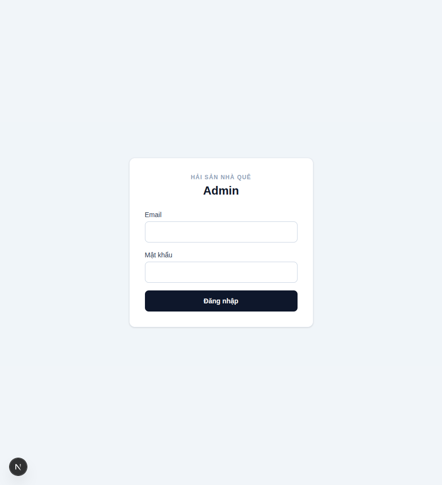
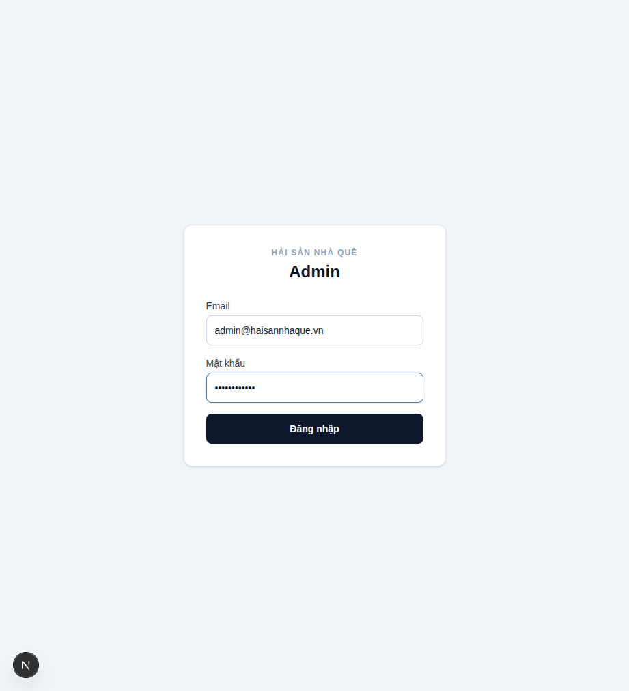
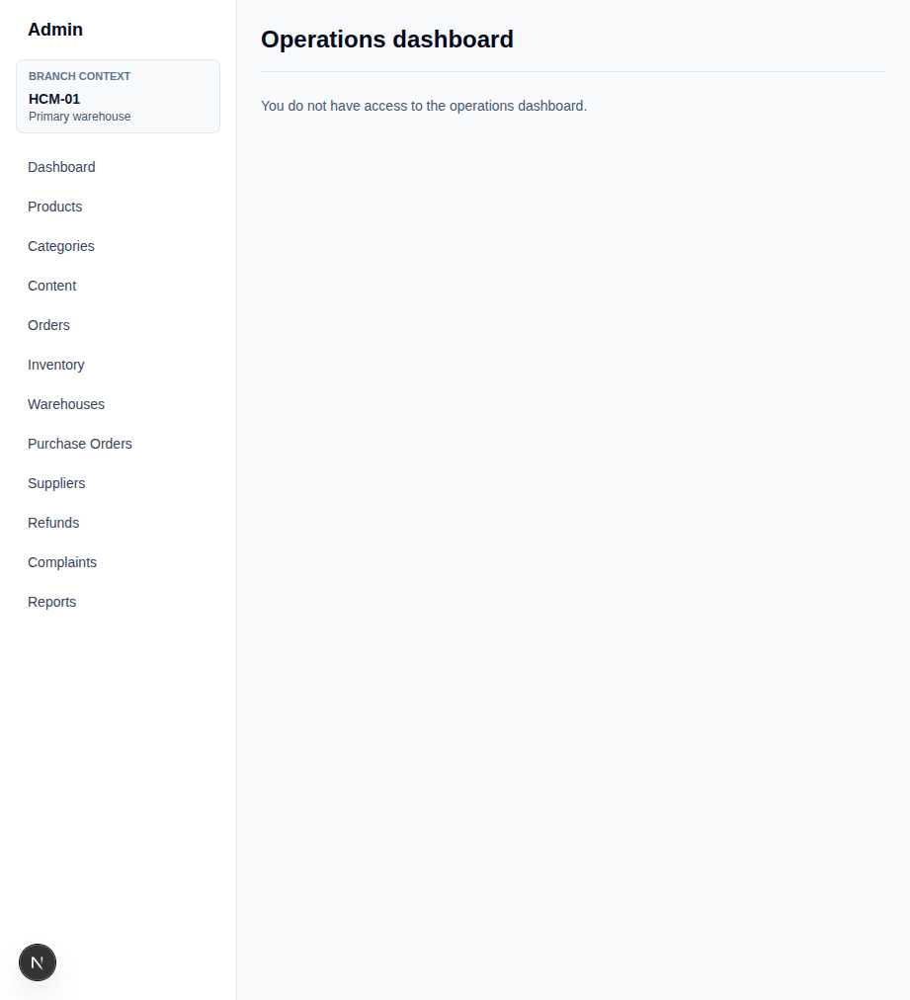
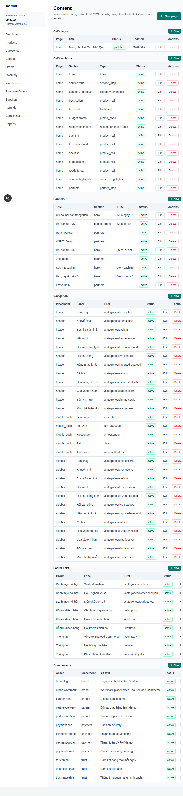
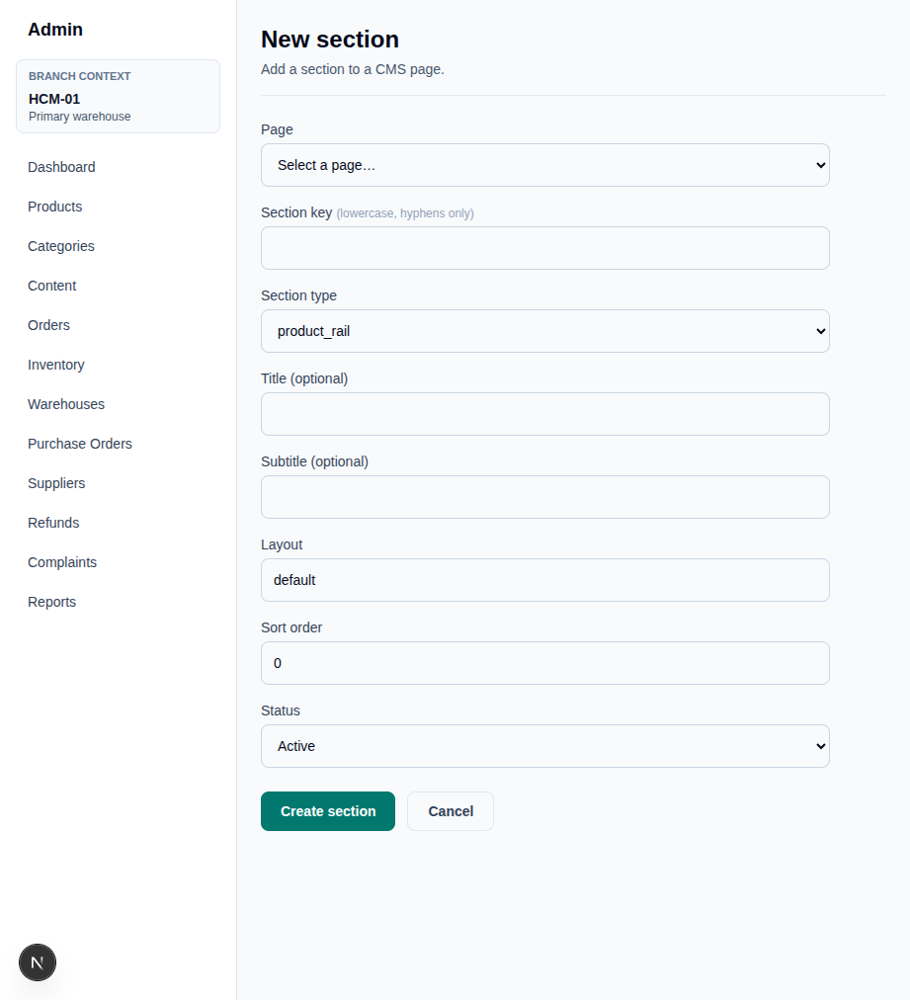
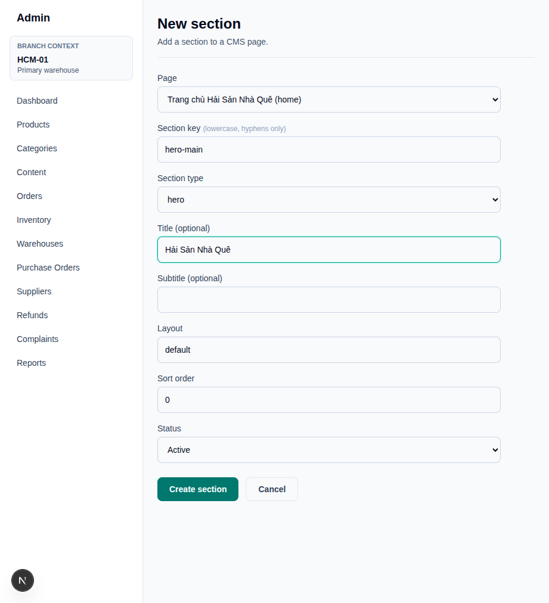
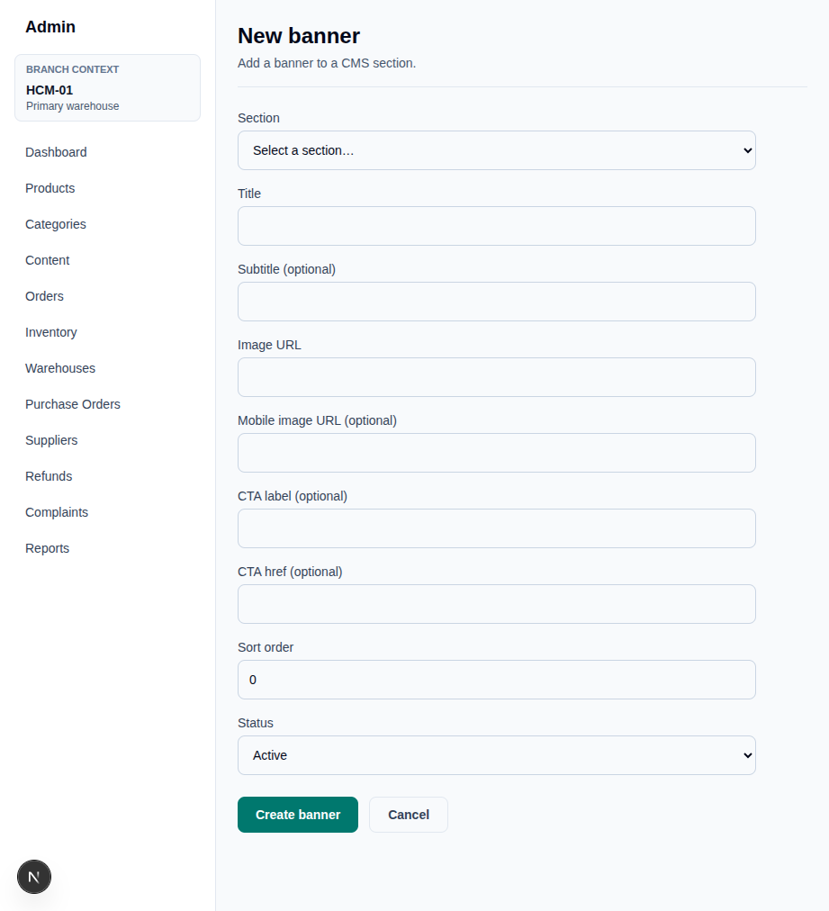
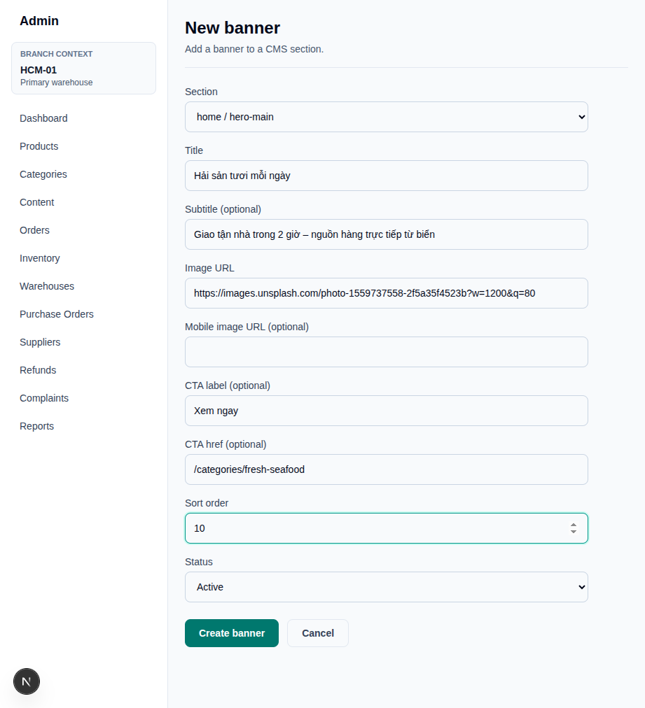
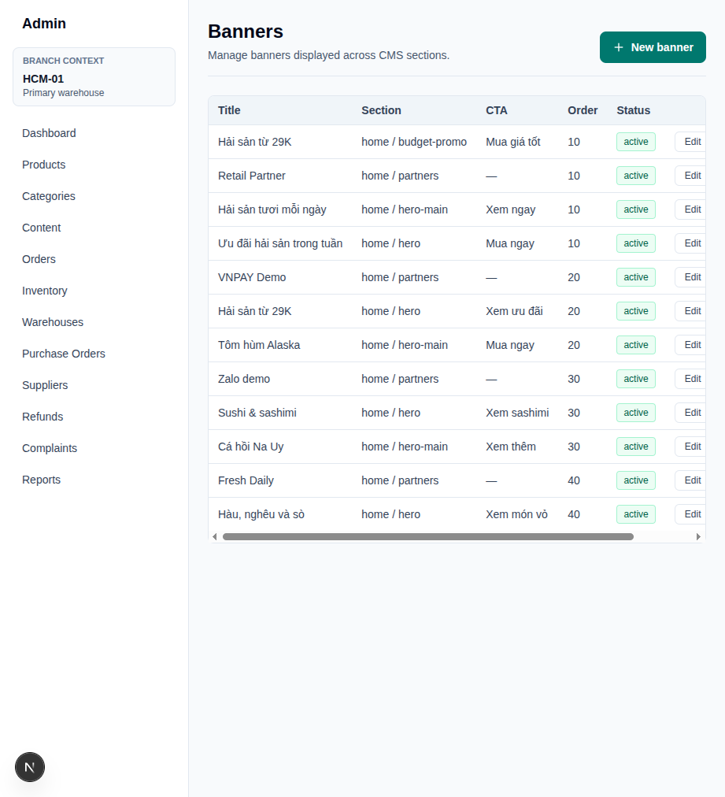
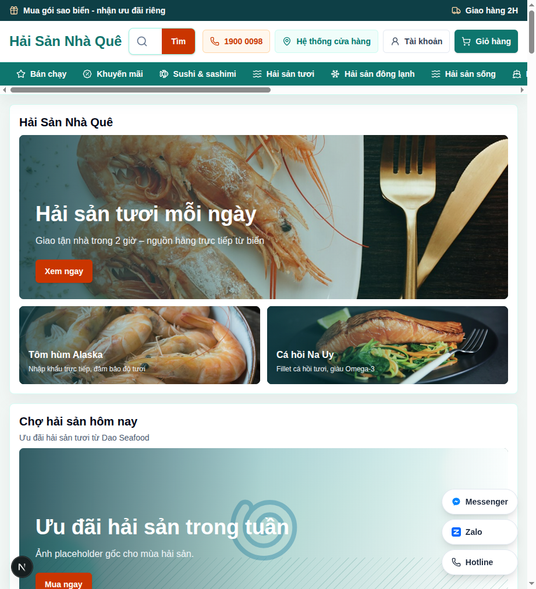

# Banner Configuration Guide

This guide walks through configuring homepage hero banners via the Admin panel.

## Prerequisites

- Admin account with `super_admin` role
- Run `node scripts/create-user.mjs` then `node scripts/assign-admin.mjs` if the account doesn't exist yet

---

## Step 1 — Log in to Admin

Navigate to `/admin/login`.

Enter your credentials and click **Đăng nhập**.

---

## Step 2 — Go to Content Management

After login you land on the Admin dashboard. Click **Content** in the left sidebar.

The Content page shows all CMS records: pages, sections, banners, navigation, footer links, and brand assets.

---

## Step 3 — Create a Hero Section

Banners belong to a **section**. You need one `hero` section on the `home` page before adding banners.

Go to **Content → Sections → New** (or click the **New** button next to "CMS sections").

Fill in the form:

| Field | Value |
|---|---|
| **Page** | `Trang chủ Hải Sản Nhà Quê (home)` |
| **Section key** | `hero-main` (lowercase, hyphens only) |
| **Section type** | `hero` |
| **Title** | Optional heading shown above the banner grid |
| **Sort order** | `0` (lower = appears higher on the page) |
| **Status** | `Active` |

Click **Create section**. You are redirected back to the Content page.

---

## Step 4 — Add Banners

Navigate to **Content → Banners → New**.

### Banner layout rules

The hero section renders banners by sort order:

| Sort order | Position |
|---|---|
| Lowest (e.g. 10) | Large featured hero — 2/3 width, full height |
| 2nd (e.g. 20) | Compact side banner — top right |
| 3rd (e.g. 30) | Compact side banner — bottom right |
| 4th–5th | Second row, full-width pair |

### Banner form fields

| Field | Notes |
|---|---|
| **Section** | Select `home / hero-main` |
| **Title** | Text overlaid on the image |
| **Subtitle** | Optional secondary line |
| **Image URL** | Full URL (Supabase Storage, CDN, Unsplash, etc.) — see note below |
| **Mobile image URL** | Optional; falls back to desktop image if empty |
| **CTA label** | Button text, e.g. `Xem ngay` |
| **CTA href** | Link, e.g. `/categories/fresh-seafood` |
| **Sort order** | Controls slot position (see table above) |

Click **Create banner**.

Repeat for each banner you want in the grid, incrementing sort order by 10.

---

## Step 5 — Verify the Banners List

After creating all banners, the Banners list at `/admin/content/banners` shows all entries with their section assignment, CTA, order, and status.

---

## Step 6 — View on Storefront

Visit `/` — the hero grid will render with the real images.

---

## Image URL notes

Any public image URL works. The component uses `<Image … unoptimized>` so no Next.js domain configuration is required.

**Recommended sources:**
- **Supabase Storage** — create a public bucket (`banners`), upload files, copy the public URL
- **Cloudflare Images / R2** — CDN-hosted, fast globally
- Any `https://` URL that returns an image

**Avoid** URLs containing `placehold.co` — those trigger the teal placeholder fallback instead of showing the real image.

---

## Editing or deactivating a banner

From `/admin/content/banners`, click **Edit** on any row. You can update any field, change sort order, or set Status to **Inactive** to hide it from the storefront without deleting it.
