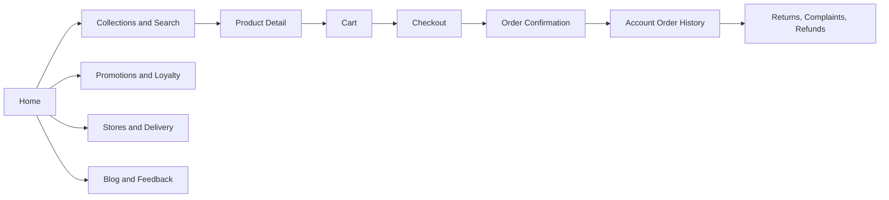
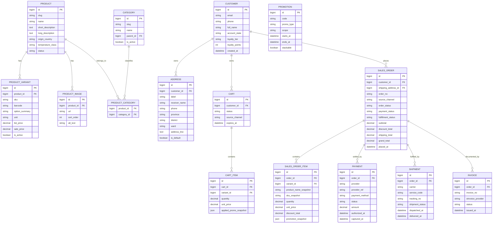
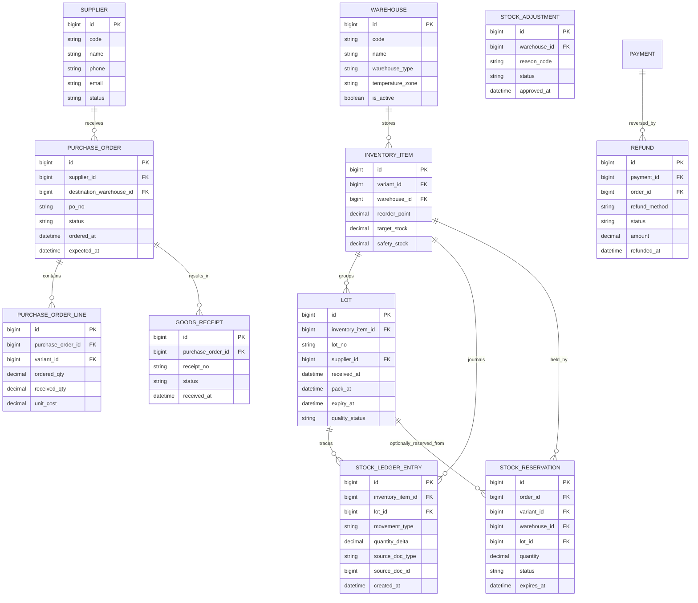
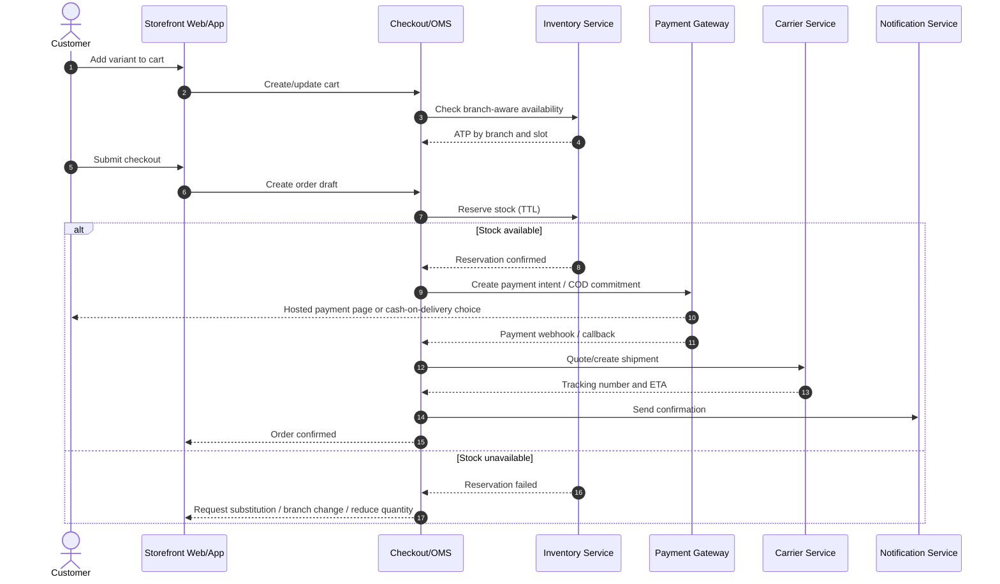
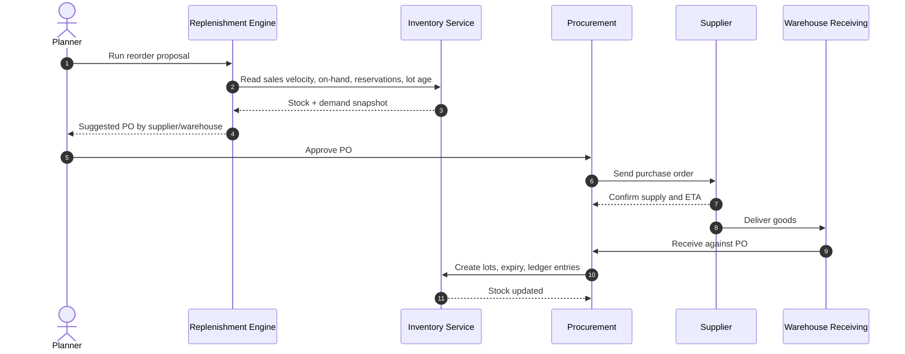

# Product design document for a daohaisan.vn-equivalent commerce platform

## Executive summary

As of May 26, 2026, daohaisan.vn is a Vietnamese direct-to-consumer seafood and sashimi commerce site with a strongly curated homepage, prominent category-led merchandising, flash-sale and gift promotion mechanics, branch/store discovery, loyalty features, and customer account pages for order history, addresses, wishlist, and rewards. The public site also exposes operationally important business rules such as minimum order handling thresholds, local “2H” delivery, COD and online payments, nationwide shipping variants, and customer-service escalation/refund policies. citeturn53view0turn14view0turn25view0turn24view0turn23view0turn30view2

The strongest architectural signal is that the current storefront runs on Haravan: the site’s robots.txt explicitly states “we use Haravan as our ecommerce platform,” and disallows routes such as `/cart`, `/checkout`, `/account`, and `/search`. Public search results and redirects also surface Haravan account/checkouts behavior, while separate public subdomains exist for admin and customer applications. citeturn52view1turn15view0turn16search0turn16search3turn26search3

There is also evidence of a richer back-office operating model than the public storefront alone suggests. Publicly indexed snippets from `docsadmin.daohaisan.vn` describe a centralized back office with website-order handling, TikTok Shop order handling, purchase-order flows, stock-analysis/reorder suggestions, customer-grouping and campaigns, cart tracking, call-center tools, reporting, and KiotViet-connected product/order data. Those pages are marked as internal in their own snippets, so this report uses them only to infer high-level module scope, not confidential operational detail. citeturn34search1turn34search3turn34search8turn34search10turn33search10turn33search13

Absent explicit constraints, the best target architecture is not a simple brochure-shop clone. It is an omnichannel commerce platform with a strong OMS/WMS core, because the public business model already mixes fresh/live/frozen/ready-to-eat goods, branch-based fulfillment, delivery-zone logic, loyalty, customer-service recoveries, and promotional gifting. A faithful clone therefore needs catalog and checkout parity **plus** inventory reservations, warehouse/branch stock, lot and expiry control, procurement, returns/refunds, and multi-channel integrations. citeturn53view0turn6view2turn24view0turn30view2turn34search0

My recommended default stack, assuming a medium-scale launch and no legacy constraints, is **Next.js + NestJS + PostgreSQL + Redis + Meilisearch/OpenSearch**, deployed in one AWS region with Multi-AZ data services, CDN edge caching, carrier/payment/Zalo integrations, and a clean separation between storefront BFF, OMS, inventory, and background jobs. A Django/PostgreSQL stack is also highly viable for faster back-office CRUD development, while Java/Spring is the best fit when enterprise controls and long-term multi-team scaling outweigh delivery speed. These are design recommendations, not facts about the current website. 

A realistic delivery estimate for a **medium-scale custom build** is **90–130 person-weeks**, typically **5–7 calendar months** with a 7–9 person cross-functional team. A reasonable planning budget is **USD 220k–450k for delivery**, plus **USD 3k–12k per month** in infrastructure and operational SaaS before payment, shipping, and messaging transaction fees. These are planning estimates derived from the scope below.

| Decision area | Recommendation |
|---|---|
| Delivery model | Headless commerce with strong OMS/WMS core |
| Default stack | Next.js + NestJS + PostgreSQL + Redis + Meilisearch/OpenSearch |
| Inventory design | SKU + variant + warehouse/branch + lot/expiry + reservation ledger |
| Order design | Explicit lifecycle states, carrier/webhook orchestration, refund methods, invoice support |
| Promotions | Coupons, flash sale, threshold gifts, loyalty points, customer groups |
| Search | Start with Postgres/Meilisearch for medium scale; upgrade to OpenSearch when SKU count or faceting complexity grows |
| Compliance posture | Hosted payment pages to minimize PCI scope, admin MFA, audit logs, Vietnam PDPD-ready data governance |
| Deployment posture | Single-region production with Multi-AZ database/cache; warm DR for medium+ |

## Source baseline and assumptions

The design below combines three evidence types. First, it uses the public storefront, indexed product/collection/policy/content pages, and robots rules to capture customer-facing behavior. Second, it uses publicly indexed back-office snippet metadata only at a module-name level to infer operational scope such as procurement, reports, and website/TikTok order handling. Third, it fills unavoidable gaps with standard commerce architecture choices, clearly marked as recommendations rather than observations. This distinction matters because `/cart`, `/search`, `/checkout`, and `/account` are crawler-restricted on the live site, so some details must be inferred from policy pages and indexed snippets rather than fully replayed end-to-end. citeturn52view1turn22view0turn16search0turn34search1turn34search8

**Observed baseline on the target website**

| Dimension | Observed baseline |
|---|---|
| Core business | Retail seafood/sashimi orientation with curated category browsing, pricing, promotions, and content-led merchandising. citeturn53view0 |
| Geography | Hồ Chí Minh city local delivery with stated 2-hour service for many zones, plus nationwide delivery by coach/express/air depending area and order value. citeturn24view0 |
| Stores and fulfillment presence | Public store-locator page lists physical stores and partner sales points in Aeon locations. citeturn19view0 |
| Language | Public pages inspected are Vietnamese; no language switch surfaced in the inspected homepage, account, store, or policy pages. citeturn53view0turn14view0turn19view0 |
| Loyalty | Named customer tiers and point accrual/redemption are public. citeturn25view0 |
| Omnichannel posture | Partner logos on the homepage plus indexed admin snippets for website and TikTokShop order handling indicate a broader multi-channel operating model. citeturn53view0turn33search13turn34search1 |
| Platform signals | robots.txt states Haravan; public evidence also points to KiotViet-linked back-office operations. citeturn52view1turn39view1turn33search10 |
| Customer support channels | Hotline, Messenger, and Zalo are persistent contact channels across public pages. citeturn53view0turn19view0turn22view0 |

**Planning assumptions because user scale, budget, and timeline are unspecified**

| Scale option | Monthly completed orders | Peak concurrent sessions | Active SKUs | Warehouses / branches | Recommended search tier | Recommended deployment posture |
|---|---:|---:|---:|---:|---|---|
| Small | 5k–15k | 300–700 | up to 20k | 1–3 | Postgres FTS + trigram or Meilisearch | Single region, app replicas, managed DB |
| Medium | 20k–60k | 1k–3k | 20k–100k | 3–10 | Meilisearch or OpenSearch | Single region, Multi-AZ DB/cache, CDN |
| Large | 80k–250k+ | 5k–12k | 100k–500k+ | 10–30+ | OpenSearch | Multi-AZ + DR region, stronger event backbone |

These scale bands are purely planning bands for estimation. The current public website does not disclose actual transaction volume.

## Functional specification

The public site is built around a merchanting-heavy, category-first experience. The homepage exposes top-level browsing paths such as best sellers, promotions, sushi/sashimi, frozen seafood, live seafood, imported seafood, salmon, oysters, shellfish, crab, shrimp, squid, ready-to-eat, and sauces. Product cards display discounts, badges, sold counts, multiple choices, and out-of-stock states; account pages expose reward, order, address-book, and wishlist functionality; and policies describe checkout and delivery/payment rules. Because `/search` and `/checkout` are crawler-restricted, the strongest evidence for those flows comes from the site’s own ordering instructions and payment/shipping pages. citeturn53view0turn20view0turn14view0turn22view0turn23view0turn24view0

**Customer-facing feature inventory**

| Area | Public baseline on target site | Required replica capability |
|---|---|---|
| Homepage and IA | Curated landing page with category tabs, flash sale timer, hero merchandising, partner logos, and contact surfaces. citeturn53view0 | Merchantable homepage managed by CMS blocks; campaign scheduling; reusable section templates; region-aware hero content. |
| Search | Ordering instructions explicitly tell users to “search for products in the search box”; robots disallow `/search`, confirming the route exists but is crawler-blocked. citeturn22view0turn52view1 | Full-text search with typeahead, typo tolerance, synonym support, merchandising boosts, zero-results recovery, and analytics on query-to-conversion. |
| Catalog and categories | The homepage and collections show deep category merchandising rather than generic browsing only. Collection pages expose paginated product lists. citeturn53view0turn20view0 | Hierarchical categories, collection landing pages, merchandising rules, pinned products, collection banners, and SEO-friendly slugs. |
| Filters and sorting | The public crawl strongly surfaces curated categories and pagination, but not obvious faceted controls; the baseline appears category-led rather than facet-led. citeturn53view0turn20view0 | For a faithful v1, category-led browse is enough; for scalability, add facets for availability, origin, temperature class, size/weight, price, promo, and branch availability. |
| Product detail page | PDP shows SKU, size/spec, condition, origin, safety/quality claims, quantity selector, variants/options, gift selection, promotion notice, add-to-cart, and Zalo ordering. It also shows trust badges and recommendations. citeturn6view2turn6view4 | Rich PDP with images, variant matrix, branch-aware availability, preparation guidance, origin/compliance docs, promotional eligibility, related items, and customer-service CTAs. |
| Cart | Public cart page shows empty-state UX, continue-shopping, and recommendation cross-sell modules. citeturn9view0 | Persistent cart, guest cart, mini-cart, coupon/gift evaluation, shipping-estimate preview, and abandoned-cart recovery events. |
| Checkout | The ordering guide states flow steps: choose product, buy-now/add-to-cart, pay, and fill shipping info; payment/shipping pages describe COD, bank transfer, MoMo, VNPAY, and area-dependent shipping rules. citeturn22view0turn23view0turn24view0 | Guest and logged-in checkout, address validation, scheduled delivery slots, payment intent + callback handling, prepayment rules by zone, tax/invoice selection, and order confirmation. |
| Promotions | The site shows flash sales, discounts, “buy 3 get 1,” threshold gifts, loyalty tiers, and reward points. PDP popups also indicate threshold conditions for gifts/discounts. citeturn53view0turn6view4turn25view0 | Rule engine supporting coupons, customer groups, free gifts, bundles, timed campaigns, price lists, loyalty point redemption, and conflict-resolution/prioritization between offers. |
| Accounts | Indexed account pages expose login/register, remember-me, forgot password, order management, address book, wishlist, and points/offers. citeturn16search0turn14view0turn15view2 | Customer identity, order history, saved addresses, payment preferences, rewards wallet, wishlist, profile editing, password reset, and consent management. |
| Reviews / feedback | The inspected PDP did not surface traditional star-rating widgets, but the site has a dedicated customer-feedback content section and video feedback posts. citeturn27view0turn26search0 | Two-layer approach: structured per-product reviews/ratings for commerce plus editorial testimonial/video modules for trust and SEO. |
| Multi-language | Vietnamese-only copy was surfaced in the inspected public pages. citeturn53view0turn14view0 | Keep v1 Vietnamese-only for parity, but model all customer-visible text in an i18n-ready way so English or bilingual operation can be enabled later without schema rework. |
| SEO | Product, collection, policy, blog, and account/store pages all appear indexable in public search; robots expose sitemap and crawl controls. citeturn7search0turn10search3turn17search1turn29search0turn52view1 | Canonicals, sitemap(s), product structured data, collection structured data where appropriate, SEO metadata per page type, redirects, robots tuning, and content templates. |
| Analytics | Public analytics tooling is not directly visible from the crawl. Google’s GA4 docs show ecommerce event models for product views, carts, checkout, and purchase. citeturn45search1turn45search3 | GA4 ecommerce event model, campaign attribution, internal search analytics, cohort/retention dashboards, and server-side event forwarding where needed. |
| Stores / contact / support | Store locator, hotline, Messenger, and Zalo are all first-class public UX elements. citeturn19view0turn53view0turn26search9 | Persistent support entry points, store pages with map/address/hours, and customer-service workflows connected to CRM/order context. |
| Content and CRM-led marketing | News, policy, feedback, and topic sections such as tips, dishes, health, and travel are exposed as content hubs. citeturn17search3turn27view0 | CMS with blog categories, video embeds, SEO templates, campaign landing pages, and internal linking to products/collections. |

**Back-office and operational feature inventory**

| Area | Public evidence | Required replica capability |
|---|---|---|
| Role-based operations | Indexed admin snippets describe function-by-department access and permissions. citeturn34search8turn34search9turn34search10 | RBAC with roles such as CSR, Marketing, Store Ops, Warehouse, Procurement, Finance, and Super Admin; object-level permissions and audit trails. |
| Procurement / purchase orders | Indexed admin snippets expose PO2/PO, reorder suggestions, PO processing, transfers, and printing. citeturn33search0turn33search3turn33search5 | Reorder engine, supplier-facing POs, approval gates, receiving, discrepancy handling, transfers, landed-cost support, and procurement reporting. |
| Catalog back office | Admin snippets expose “Hàng hoá” and KiotViet product/inventory APIs expose products, attributes, variants, and per-branch inventories. citeturn34search7turn39view1turn39view3 | Product master, variants, media, attributes, category mapping, price lists, publish status, branch-level availability, and content QA workflow. |
| Campaigns and vouchers | Admin snippets explicitly list vouchers, voucher groups/templates, and campaigns. citeturn33search0turn34search8 | Central promotion engine plus campaign dashboard, segment targeting, redemption limits, and promotion A/B testing. |
| Customer 360 | Admin snippets describe “Chân dung khách hàng” with total spend, invoices, frequent products, and customer update/sync behavior. citeturn33search12 | Unified customer profile, LTV/RFM, order timeline, refund history, address and preference data, support interactions, and consent flags. |
| Abandoned cart recovery | “Giỏ hàng” snippet explicitly refers to realtime cart tracking and identifying carts that did not become orders. citeturn33search1 | Abandoned cart event model, TTL windows, remarketing segmentation, and message-trigger orchestration. |
| Website order management | Admin snippets describe centralized viewing/processing of website orders and one-click sync to KiotViet-linked order records. citeturn33search10 | OMS queue, branch assignment, fraud/risk review, order edits, substitutions, cancellation/refund actions, and integration logs. |
| TikTok / marketplace orders | Admin snippets explicitly list TikTok Shop order handling alongside website order handling. citeturn33search13 | Channel-aware order ingestion, source attribution, status mapping, inventory de-duplication, and channel SLA reporting. |
| Reporting | Admin reporting snippets mention product quantity reports, purchase/transfer reports, customer-group reports, and package/customer reports. citeturn34search0 | Sales, margin, stock age, shrinkage, fulfillment SLA, campaign ROI, customer cohort, and supplier performance dashboards. |
| Call center | Indexed admin snippets mention click-to-call and call list/record tracking. citeturn33search2 | Softphone integration, order-linked call tasks, QA notes, callback queues, and customer-contact audit logs. |
| System operations | Admin menu snippets mention user management, permissions, job scheduler, cache, categories, and call-center system areas. citeturn34search6 | Scheduler/queue admin, cache invalidation, feature flags, integration health, retry queues, and admin observability. |

The target site’s UX is visibly mobile-aware: public pages expose mobile menu icons, persistent hotline/contact affordances, and app-like shortcuts to Messenger, Zalo, and account areas. A custom replica should therefore be **mobile-first**, optimized for fast thumb navigation, sticky add-to-cart on PDP, a compact cart/checkout flow, and branch-aware pickup/delivery selection. Accessibility should align with WCAG 2.2, which W3C recommends as the current version for new or updated accessibility work. citeturn53view0turn19view0turn14view0turn41search3

To properly replicate the live business, inventory cannot be modeled as a single quantity field. The product mix is explicitly fresh/live/frozen/ready-to-eat, shipping is zone- and time-sensitive, and complaint policies are product-quality-specific. That combination justifies warehouse/branch inventory, reservations, lot tracking, temperature class, and optional expiry control even if not every one of those controls is visible in the public UI. citeturn53view0turn6view2turn24view0turn30view2

**Inventory control model**

| Inventory object | Minimum fields | Core rules |
|---|---|---|
| SKU / variant | SKU code, barcode, unit, base UOM, variant attributes, temperature class, origin, pack size, weighable flag | Unique SKU required; one sellable variant per purchasable/stocked unit. |
| Warehouse / branch | Branch code, warehouse type, address, temperature zone, cutoff hours | Separate stock pools by fulfillment node; branch-aware ATP exposure to storefront. |
| Lot / batch | Lot number, supplier, received date, expiry/use-by, quarantine flag | Required for perishable/import-controlled items; FEFO picking for expiry-managed products. |
| Stock ledger | Movement type, quantity delta, lot, source document, actor, timestamp | Immutable ledger; on-hand is derived, not edited directly. |
| Stock reservation | Order/checkout id, SKU, branch, quantity, reservation expiry | Created at checkout; auto-released on payment timeout/cancellation/failure. |
| Stock adjustment | Reason code, quantity delta, lot, approval status | Use for shrinkage, breakage, spoilage, sample, or recount corrections. |
| Stock transfer | From branch, to branch, lines, dispatch date, receive date | In-transit stock separate from available stock. |
| Cycle count | Count plan, counter, variance, approved correction | Mandatory for fresh and fast-moving SKUs; daily for high-risk categories. |

**Order lifecycle and fulfillment model**

| Status | Meaning | Payment rule | Inventory rule | Communication rule |
|---|---|---|---|---|
| Draft checkout | Customer started checkout but has not committed | No payment yet | Optional temporary availability check | No outbound communication |
| Awaiting payment | Payment required before confirmation | Payment intent open | Hard reservation with TTL | Show countdown / send reminder if enabled |
| Pending confirmation | Order created, awaiting CSR/auto review | Paid or COD | Reservation active | Confirmation message |
| Confirmed | Ready for fulfillment | Paid, COD, or approved transfer | Reserve converts to allocation | Order accepted notification |
| Picking | Warehouse/store is collecting items | Unchanged | Allocated stock no longer sellable | Internal only unless delayed |
| Packed | Order packed and verified | Unchanged | Packed stock separate from available | Ready-to-ship notification |
| Dispatched | Handed to carrier or internal rider | Unchanged | Fulfillment in transit | Tracking/ETA notification |
| Delivery attempted | Carrier attempted but not complete | Unchanged | In transit or return leg | Delivery issue notification |
| Delivered | Goods delivered successfully | COD captured or prior paid | Inventory deducted as final sale | Delivery confirmation |
| Completed | Financial and service window closed | Settled | Closed | Optional review / loyalty follow-up |
| Cancelled | Order voided before completion | Payment void/refund if needed | Reservation released or stock returned | Cancellation confirmation |
| Returned / partially returned | Goods returned after delivery | Refund or credit action | Return-to-stock / quarantine decision | Return status notification |
| Refunded | Monetary or credit refund executed | Refund complete | No additional effect beyond return decision | Refund confirmation |

The live site’s complaint policy is operationally important because it implies **multiple refund destinations**, not just a single gateway refund flow. It publicly mentions exchange/return, refunds by bank transfer, refunds via voucher conversion, and refunds into a customer points account, with stated processing windows. The replica should therefore model refund instrument and refund ledger separately from payment instrument. citeturn30view2

## Data model and APIs

A custom build should treat **catalog**, **orders**, **inventory**, **payments**, and **customer CRM/loyalty** as first-class bounded domains. The minimum viable design is a modular monolith or well-bounded service design, not a flat CRUD back office. Seafood retail introduces unusual requirements: same-day local delivery, branch-aware stock, possible substitution, lot/quality assertions, and complaint/refund recoveries that may affect customer trust more than raw transaction volume. citeturn6view2turn24view0turn30view2

The key modeling decision is to separate **inventory reality** from **what the storefront can sell right now**. The current business clearly operates with branch-local delivery promises, variable shipping thresholds, and quality-sensitive goods, so `on_hand`, `reserved`, `allocated`, `picked`, `in_transit`, `quarantined`, and `expired` should be distinct computed states, not overloaded flags. KiotViet’s official public API is directionally consistent with this need because it exposes product attributes/variants and per-branch inventory structures, including `branchId`, `branchName`, and `onHand`. citeturn24view0turn39view3

**Recommended API surface**

The cleanest design is **GraphQL for storefront reads and composition**, and **REST for operational writes, integrations, and admin actions**. This keeps the customer-facing layer flexible while preserving the idempotency and observability needed for payments, inventory, carriers, and procurement.

| Endpoint | Method | Auth | Purpose | Notes |
|---|---|---|---|---|
| `/graphql` | POST | Public/customer token | Storefront read API for home, collections, PDP, cart summary | Query-cost limiting; CDN cache persisted queries when public |
| `/v1/catalog/products` | GET | Public | Search/list products | Supports category, promo, availability, tag, price filters |
| `/v1/catalog/products/{slug}` | GET | Public | PDP payload | Includes variants, media, trust badges, recommendations |
| `/v1/cart` | GET/POST/PATCH | Session or customer token | Create/update cart | Guest cart merge on login |
| `/v1/checkouts` | POST | Session or customer token | Create checkout draft | Creates reservation candidates |
| `/v1/orders` | POST | Session or customer token | Place order | Idempotency key required |
| `/v1/orders/{orderNo}` | GET | Customer/admin token | Order details and tracking | Channel-safe order lookup |
| `/v1/orders/{id}/cancel` | POST | Customer/admin token | Cancel eligible order | Releases reservation or starts refund flow |
| `/v1/payments/intents` | POST | Session/customer token | Start payment | Supports MoMo, VNPAY, bank transfer intent, COD |
| `/v1/payments/webhooks/{provider}` | POST | Provider signature | Payment callback | Signature verification + replay protection |
| `/v1/shipments/quotes` | POST | Session/customer token | Estimate fee/ETA | Zone and temperature-aware |
| `/v1/shipments/webhooks/{carrier}` | POST | Carrier signature | Tracking/status callback | Maps external statuses into internal lifecycle |
| `/v1/admin/inventory/adjustments` | POST | Admin role | Stock adjustment | Four-eyes approval for high-value changes |
| `/v1/admin/purchase-orders` | GET/POST | Procurement role | PO create/manage | Supplier and branch-aware |
| `/v1/admin/receipts` | POST | Warehouse role | Receive PO and create lots | FEFO and quarantine support |
| `/v1/admin/reports/*` | GET | Admin role | Operational and BI reporting | Long-running queries should be async/exportable |

For external compatibility, the reference patterns from the current ecosystem are clear: Haravan APIs require authentication and are rate-limited with a leaky-bucket model; KiotViet’s public API uses OAuth 2.0 and requires retailer and bearer-token headers; Haravan and carrier ecosystems also support webhook-driven updates. Payment and messaging integrations likewise depend on redirect/callback or webhook patterns rather than synchronous-only APIs. Since January 1, 2026, Zalo’s old standalone ZNS documentation path is being merged into ZBS Template Message, which matters for long-term notification design. citeturn46search1turn46search0turn39view2turn39view4turn46search6turn47search12turn48search3turn47search1turn50search3turn54search0

## Architecture, security, and non-functional requirements

The current live system shows a practical Vietnam-market stack shape: Haravan storefront, KiotViet-connected product/order data, and specialized internal admin capabilities. A custom rebuild should preserve the business capabilities while reducing platform coupling. Concretely, that means a composable application with: storefront UI, commerce BFF, OMS, inventory/procurement module, integration workers, CMS/content service, search service, and an analytics/event pipeline. This can be implemented as a modular monolith first and evolved into services only where scaling pressure is real. citeturn52view1turn34search1turn33search10turn39view1

**Technology stack comparison**

| Stack | Best fit | Pros | Cons | Indicative build effort | Indicative monthly infra cost |
|---|---|---|---|---|---|
| **Node.js + Next.js + NestJS + PostgreSQL** | Default recommendation for headless commerce | End-to-end TypeScript, fast UI/backend iteration, strong ecosystem for commerce integrations, easy BFF/SSR pattern, strong hiring flexibility | Requires discipline around architecture and runtime performance; some teams over-fragment into microservices too early | **Lowest** among the three for this scope | Small: **$800–2.5k**; Medium: **$3k–12k**; Large: **$12k–45k+** |
| **Django + Next.js or Django + HTMX/SSR + PostgreSQL** | Strong admin-heavy build where back-office speed matters most | Mature ORM/admin, excellent CRUD productivity, reliable background-job ecosystem, good fit for operational systems | Frontend/backend split can be less uniform; custom storefront personalization often feels less natural than a TS-first stack | **Low-to-medium** | Small: **$700–2.2k**; Medium: **$3k–11k**; Large: **$12k–40k+** |
| **Java / Spring Boot + Next.js + MySQL or PostgreSQL** | Enterprise governance, many teams, long-lived integrations | Excellent transaction rigor, strong typed contracts, mature integration/testing patterns, easier fit for complex enterprise controls | Highest implementation overhead, slower early-stage iteration, larger team needed to move at the same pace | **Medium-to-high** | Small: **$1k–3k**; Medium: **$4k–14k**; Large: **$15k–50k+** |

The infrastructure ranges above assume managed cloud services, CDN, caching, background jobs, monitoring, backups, and integration traffic, but **exclude** per-transaction payment, carrier, SMS/Zalo, and email costs. AWS pricing itself is pay-as-you-go across EC2, CloudFront, ELB, and ElastiCache; CloudFront and ELB have no fixed “platform fee” concept beyond usage, while RDS Multi-AZ is the right availability baseline for production relational data. citeturn44search11turn44search1turn44search2turn44search7turn44search0

**Recommended integration map**

| Domain | Recommended options | Why it fits this business | Evidence / reference |
|---|---|---|---|
| Payments | MoMo, VNPAY, COD, bank transfer | The live site already supports MoMo, VNPAY, COD, and direct transfer; custom build should keep parity. | daohaisan public payment/shipping pages list these methods; MoMo and VNPAY both support redirect/callback/IPN models. citeturn23view0turn24view0turn47search12turn48search3 |
| Shipping carriers | GHN, Ahamove, GHTK, optional GrabExpress | The business needs fast local delivery plus broader national shipping. GHN supports create/update/cancel/tracking/COD callbacks; Ahamove supports real-time delivery integration; GHTK exposes order, warehouse/address, and realtime webhook APIs. | citeturn24view0turn47search1turn50search3turn50search8turn50search2 |
| Messaging | Email provider, SMS/OTP provider, Zalo business messaging / template notifications | The live site relies heavily on hotline, Messenger, and Zalo contact surfaces; transactional messaging should be native to OMS events. | Persistent Zalo/Messenger presence on the site; Zalo developer docs describe messaging APIs and the 2026 ZNS-to-ZBS transition. citeturn53view0turn54search0turn54search4 |
| ERP / POS / retail back office | KiotViet as immediate parity option; optionally Odoo / SAP B1 / Microsoft BC for larger estates | Public evidence already points to KiotViet-linked operations for product, inventory, and orders. | KiotViet public API officially covers categories, products, orders, invoices, customers, purchase orders, branches, inventory-related data structures, and webhooks. citeturn39view1turn39view4 |
| Accounting / e-invoice | Haravan Invoice, KiotViet eInvoice, or accounting connector to MISA / QuickBooks / Xero / SAP B1 | Vietnam commerce often needs e-invoice-friendly flows; finance should not be glued to OMS internals. | Haravan Invoice and KiotViet documentation both expose invoice/eInvoice capabilities. citeturn35search11turn38view1 |
| Analytics | GA4 ecommerce events; separate BI warehouse optional at medium+ scale | Critical for promotions, search, checkout, and loyalty optimization. | Google officially documents ecommerce events and purchase/reporting flows in GA4. citeturn45search1turn45search3turn45search15 |

Search, SEO, and analytics should be treated as platform features, not afterthoughts. Google explicitly recommends structured data for products, canonical URLs for duplicate-content control, and sitemaps for crawl discovery. The current site’s robots rules already show this pattern by restricting carts/accounts/checkouts while exposing a sitemap, so a replica should preserve that discipline rather than letting sensitive or low-value URLs pollute search indexes. citeturn41search14turn41search6turn41search10turn52view1

Security and compliance should aim for **scope minimization**. For card payments, the safest posture is hosted payment pages/redirects so card data never touches the merchant application. PCI SSC states that PCI DSS is the baseline for protecting payment account data, and the SAQ A guidance still imposes obligations on the merchant web server that hosts the payment redirection mechanism. On authentication, all staff/admin roles should use MFA; CISA explicitly recommends phishing-resistant MFA where possible. For Vietnam operations, design for personal-data controls under Decree 13/2023/NĐ-CP, including data inventory, consent/legal-basis tracking, user-rights handling, deletion/anonymization workflows, processor agreements, and breach-response procedures. citeturn41search0turn41search16turn41search17turn42search6turn42search11

A sensible security role model for this business is: **Customer**, **CSR**, **Marketing**, **Store Ops**, **Warehouse/Dispatch**, **Procurement**, **Finance**, **Supplier/Vendor access**, and **Super Admin**. That role breakdown mirrors the department-oriented functionality visible in indexed admin-guide snippets and should be enforced with least privilege, IP/device risk checks for admin sessions, immutable audit logs for order/inventory/payment actions, and periodic access review. citeturn34search8turn34search9turn34search10

Operationally, the performance/scalability baseline should rely on CDN edge caching, managed load balancing, Redis-class caching, and Multi-AZ relational storage. AWS documents CloudFront as a low-latency CDN for static and dynamic content, ELB as automatically distributing traffic across targets/AZs, ElastiCache as a managed microsecond-latency caching layer, and RDS Multi-AZ as the high-availability baseline with automatic failover behavior. That combination is sufficient for small and medium single-region deployments and remains the right foundation for larger builds. citeturn44search15turn44search8turn44search18turn44search0turn44search6

**Non-functional requirements**

| Dimension | Small | Medium | Large |
|---|---|---|---|
| Availability target | 99.9% monthly | 99.95% monthly | 99.99% monthly |
| p95 cached page load | < 2.5 s | < 2.0 s | < 1.5 s |
| p95 catalog read API | < 300 ms | < 250 ms | < 200 ms |
| p95 checkout server step | < 500 ms | < 400 ms | < 300 ms |
| Peak concurrent users | 300–700 | 1k–3k | 5k–12k |
| Peak order creation throughput | 10/min | 60/min | 300/min |
| Peak search throughput | 25 qps | 100 qps | 500 qps |
| Inventory reservation success | ≥ 99.5% | ≥ 99.7% | ≥ 99.9% |
| RPO | 1 hour | 15 minutes | 5 minutes |
| RTO | 4 hours | 1 hour | 30 minutes |
| Audit log retention | 1–2 years | 2 years | 2–3 years |
| Order / finance retention | Policy-driven; default 7–10 years unless legal counsel sets otherwise | Same | Same |
| Analytics raw event retention | 12–14 months minimum | 14–25 months if BI used | Warehouse-backed long-term retention |

## Delivery, migration, and cost

A disciplined implementation should be phased, because the highest-risk pieces are not themes or pages. They are **inventory accuracy**, **carrier/payment idempotency**, **procurement/receiving**, **promotion conflict resolution**, and **migration/cutover**. The practical milestone structure below assumes medium scope, one primary region, and phased integrations rather than a “big bang” all-at-once launch. 

**Implementation roadmap and person-weeks**

| Milestone | Main outputs | Estimated person-weeks |
|---|---|---:|
| Discovery and blueprint | Domain model, process maps, NFRs, data migration design, integration contracts | 4–6 |
| UX and design system | IA, responsive templates, design tokens, accessibility baseline, reusable admin components | 6–8 |
| Catalog and CMS foundation | Categories, products, variants, media, CMS pages, SEO controls, search indexing | 10–14 |
| Customer commerce core | Accounts, cart, checkout, payments, shipping quotes, order confirmation, loyalty wallet | 12–16 |
| OMS and inventory core | Order lifecycle, reservations, stock ledger, warehouses/branches, pick-pack-ship, cancellation/refund | 16–22 |
| Procurement and receiving | POs, supplier workflows, goods receipt, transfers, adjustments, expiry/lot controls | 10–14 |
| Integrations | Payment gateways, carriers, email/Zalo/SMS, analytics, ERP/POS/accounting adapters | 10–16 |
| Testing and hardening | Automation, performance, security, UAT, training, runbooks | 8–12 |
| Migration and cutover | Data import, reconciliation, redirects, freeze window, go-live, hypercare | 6–8 |
| **Total** | **Medium-scale custom build** | **90–130 person-weeks** |

A small build can often be reduced to **55–80 person-weeks** by simplifying branch logic, expiry control, and integration count. A large omnichannel build with full marketplace, advanced BI, and enterprise approval/compliance patterns can rise to **140–220 person-weeks**.

**Testing strategy**

| Test layer | What to test | Minimum gate |
|---|---|---|
| Unit tests | Pricing, promo rules, points math, reservation logic, order transitions | 80%+ critical-domain coverage |
| Integration tests | Payment callbacks, carrier webhooks, ERP/POS sync, notification templates | Every external adapter stubbed and replay-tested |
| Contract tests | REST/GraphQL schemas, webhook payloads, versioning | Breaking-change detection in CI |
| End-to-end tests | Browse → PDP → cart → checkout → payment → tracking → refund/cancel | Daily on staging; smoke on prod |
| Performance tests | Home, search, PDP, cart, checkout, webhook spikes, batch imports | Must hit defined p95 targets |
| Security tests | Authz, MFA, session management, PCI scope, secret leakage, audit trails | Pre-launch pen test + dependency scanning |
| Data migration tests | Catalog, customers, loyalty, orders, redirects, image/media integrity | Reconciled row counts and business totals |
| UAT and pilot | CSR, warehouse, marketing, finance, customer journeys | Sign-off by each department owner |

Migration is feasible because Haravan officially supports product import/export by spreadsheet, order export, and broader shop backup/migration workflows, but with important limitations: order import must be done through API rather than a simple CSV round-trip, and some historical/custom settings do not transfer automatically. That means migration must be engineered as a controlled ETL program, not treated as a trivial content upload. citeturn49search0turn49search2turn49search3turn49search5

**Migration checklist**

| Checklist item | Why it matters | Completion standard |
|---|---|---|
| Normalize SKU master | Prevent duplicate or ambiguous sellable units | Every active product/variant has unique SKU, barcode, UOM |
| Rebuild category tree | Current site is category-led, so IA quality directly affects revenue | Final tree approved by merchandising and SEO |
| Import products and media | Preserve PDP parity and sales continuity | 100% media checksum pass or approved exceptions |
| Migrate policy/content pages | Shipping/payment/returns rules are operationally critical | All public-policy pages signed off by business/legal |
| Migrate blog and feedback content | SEO and trust depend on legacy content continuity | Legacy URLs mapped or redirected |
| Import customer accounts | Preserve loyalty and repeat purchase behavior | Customer IDs mapped; password-reset campaign prepared |
| Import address books | Checkout speed and conversion depend on saved addresses | Default addresses preserved |
| Migrate loyalty balances and tiers | Current site publicly exposes points and tiers | Balance reconciliation signed off by finance/CRM |
| Import open and historical orders | Needed for account history and service support | Order counts and monetary totals reconciled |
| Redirect legacy URLs | Preserve SEO equity and product discoverability | 301 matrix tested for top landing pages |
| Reconcile inventory | Cutover without stock drift | Branch/SKU variance within agreed tolerance |
| Validate payment/carrier sandboxes | Avoid go-live order/payment failure | End-to-end callbacks verified |
| Instrument analytics | GA4commerce and key funnels ready on day one | Purchase, add_to_cart, begin_checkout, search, promotion events validated |
| Freeze and cutover plan | Avoid data divergence during switchover | Explicit freeze window, rollback, and comms plan approved |

**Operational runbooks**

| Runbook | Trigger | Immediate response |
|---|---|---|
| Payment webhook failure | Payment gateway callback not acknowledged | Queue retry, verify signature, reconcile via query API, prevent duplicate capture |
| Oversell / reservation mismatch | Order accepted but no sellable stock | Attempt branch reassignment/substitution, then cancel/refund under SLA |
| Delivery failure for perishables | Failed/late delivery on fresh/live item | Contact customer immediately, decide reattempt vs refund vs store credit, quarantine returned stock if needed |
| Quality complaint / spoilage | Customer reports nonconforming goods | Open case with evidence, decide partial/full refund, exchange, points credit, or voucher credit |
| Supplier short shipment | PO partially delivered or expired-on-arrival | Receive with discrepancy, create claim, update reorder engine |
| Search/cache drift | Product updated but storefront stale | Invalidate cache/search document, replay indexing job, verify PDP consistency |
| Site degradation | Elevated error rate or DB pressure | Switch to safe mode, disable heavy exports, keep checkout path prioritized |
| Restore and recovery | Data corruption or operator error | PITR restore to staging, validate, then controlled production recovery |

**Estimated effort and cost ranges**

| Scale | Delivery effort | Indicative build budget | Indicative monthly infra/SaaS | Fit |
|---|---:|---:|---:|---|
| Small | 55–80 person-weeks | **USD 120k–220k** | **USD 800–2.5k/mo** | One region, limited warehouses, simplified promotions and procurement |
| Medium | 90–130 person-weeks | **USD 220k–450k** | **USD 3k–12k/mo** | Best match for a serious daohaisan.vn-equivalent custom platform |
| Large | 140–220 person-weeks | **USD 450k–1.2M+** | **USD 12k–50k+/mo** | Omnichannel, many nodes, richer BI, stronger governance and DR |

These cost ranges assume usage-based cloud pricing and managed infrastructure patterns rather than self-hosted operations. AWS’s pricing model for EC2, CloudFront, ELB, and ElastiCache is pay-for-usage, which is why large-range estimates widen materially as traffic, data, and queue volume increase. citeturn44search13turn44search1turn44search2turn44search7turn44search11

The most important delivery choice is **not** whether to imitate Haravan page-for-page. It is whether to preserve and strengthen the operating model the business already implies: zone-aware delivery, loyalty and promotion sophistication, branch/warehouse inventory truth, and fast service recovery. If that operating core is done well, the storefront can be visually faithful **and** materially more scalable than the current platform arrangement.