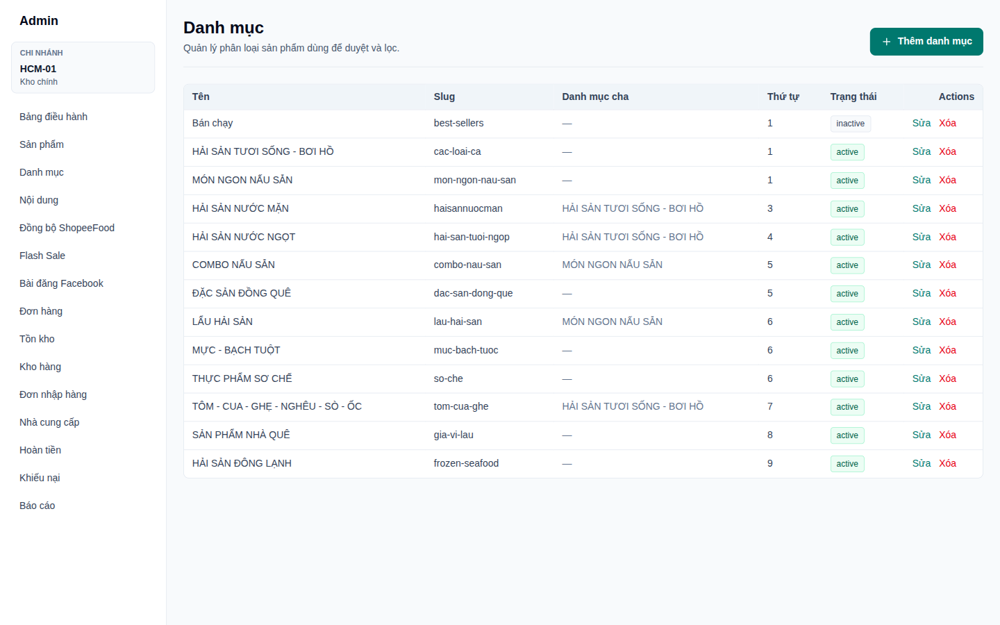
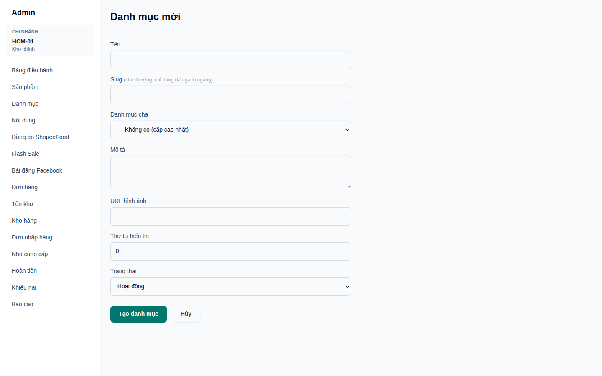
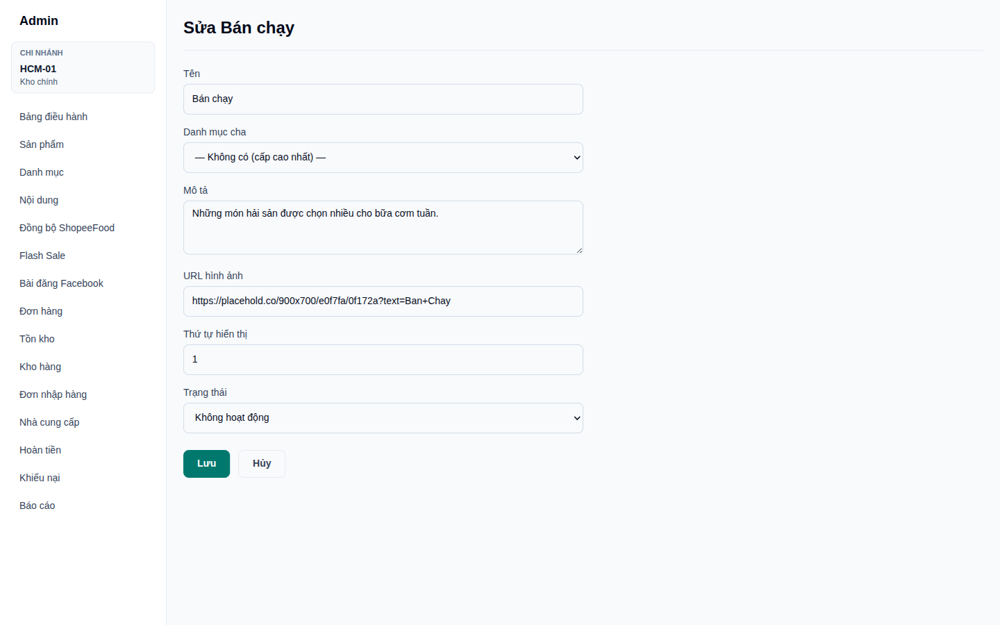
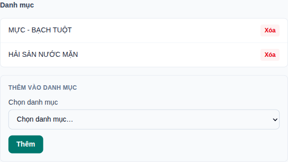
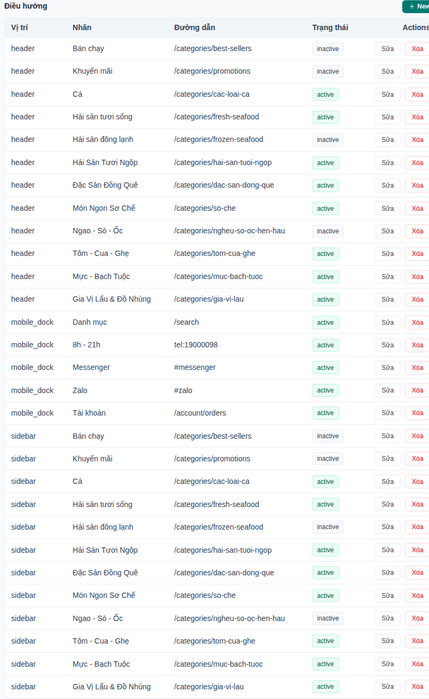
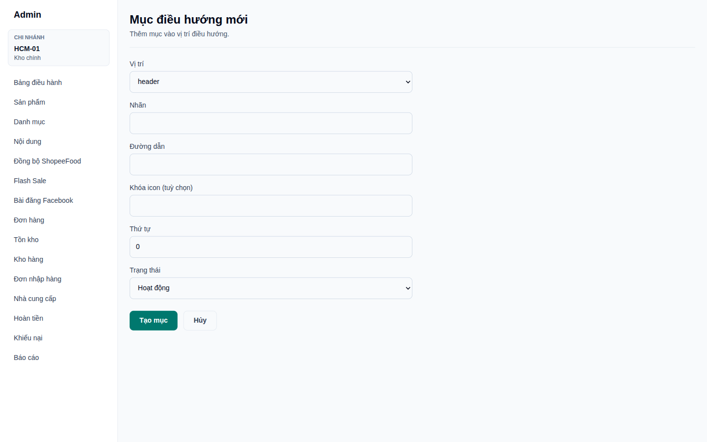
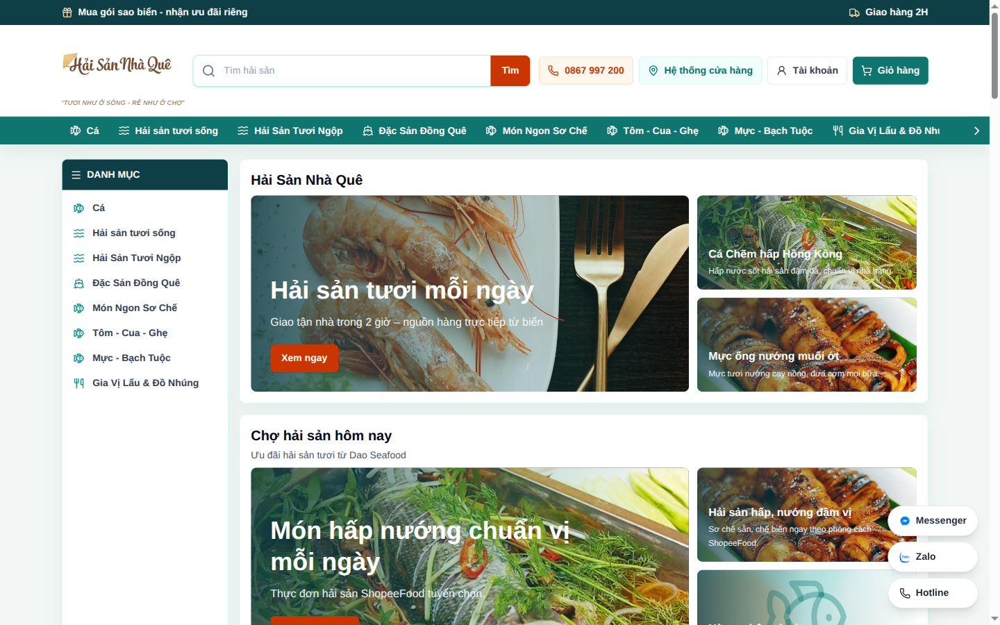
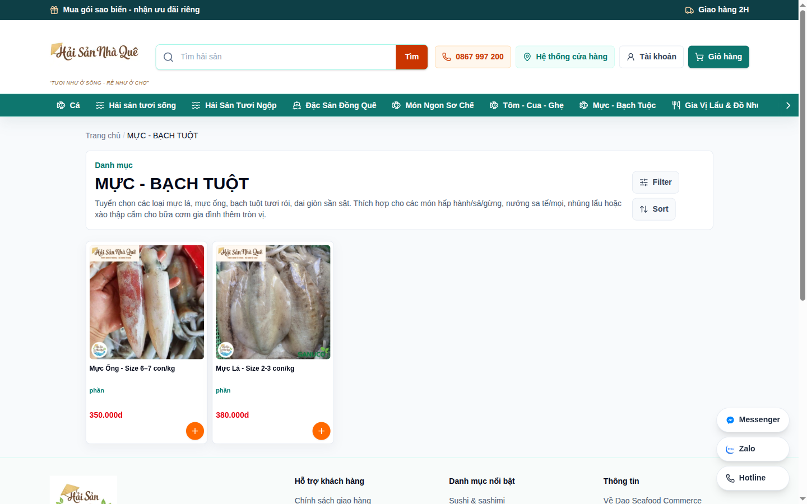

# Hướng dẫn: Làm sao để đưa danh mục vừa tạo hiện lên web

Tài liệu này dành cho người quản trị trang **haisannhaque.com**.

> **Điều quan trọng nhất cần nhớ:** tạo danh mục trong trang Admin **chưa đủ** để nó xuất hiện trên
> website. Thanh menu xanh ở đầu trang và cột **DANH MỤC** bên trái trang chủ **không tự động** lấy
> danh sách danh mục. Bạn phải thêm thủ công một **mục điều hướng** trỏ tới danh mục đó (Bước 3).

---

## Tổng quan 4 bước

| Bước | Việc cần làm | Màn hình |
|---|---|---|
| 1 | Tạo danh mục, đặt trạng thái **Hoạt động** | Admin → Danh mục |
| 2 | Gán sản phẩm (đã **Published**) vào danh mục | Admin → Sản phẩm → Sửa |
| 3 | Thêm mục điều hướng trỏ tới `/categories/<slug>` | Admin → Nội dung → Điều hướng |
| 4 | Kiểm tra lại trên website | haisannhaque.com |

---

## Bước 1 — Tạo danh mục và bật trạng thái Hoạt động

Vào **Admin → Danh mục** (`https://haisannhaque.com/admin/categories`).

Đây là nơi liệt kê toàn bộ danh mục. Cột **Trạng thái** cho biết danh mục đang `active` (hiển thị
được) hay `inactive` (đang bị ẩn). Bấm nút **Thêm danh mục** ở góc phải trên.

Điền form **Danh mục mới**:

| Trường | Cách điền |
|---|---|
| **Tên** | Tên hiển thị cho khách, ví dụ `CÁ HỒI NHẬP KHẨU` |
| **Slug** | Phần đuôi của đường dẫn, **chỉ chữ thường không dấu và dấu gạch ngang**, ví dụ `ca-hoi-nhap-khau`. Danh mục sẽ nằm tại `haisannhaque.com/categories/ca-hoi-nhap-khau` |
| **Danh mục cha** | Để `— Không có (cấp cao nhất) —` nếu đây là danh mục lớn. Chọn danh mục cha nếu đây là danh mục con |
| **Mô tả** | Đoạn giới thiệu hiện dưới tên danh mục trên web, đồng thời dùng cho SEO |
| **URL hình ảnh** | Tuỳ chọn |
| **Thứ tự hiển thị** | Số càng nhỏ càng đứng trước |
| **Trạng thái** | **Bắt buộc chọn `Hoạt động`** |

Bấm **Tạo danh mục**.

### Nếu danh mục đã tạo trước đó nhưng đang `inactive`

Trong danh sách, bấm **Sửa** ở dòng danh mục đó, đổi **Trạng thái** thành **Hoạt động** rồi bấm
**Lưu**.

> Danh mục ở trạng thái `Không hoạt động` sẽ không có sản phẩm nào hiện ra, dù bạn đã gán sản phẩm
> vào và đã thêm menu.

> **Màn hình Sửa không có ô Slug.** Slug chỉ đặt được một lần lúc tạo mới, vì vậy hãy cân nhắc kỹ ở
> Bước 1 — đổi slug sau này đồng nghĩa phải tạo lại danh mục và sửa lại mục điều hướng.

---

## Bước 2 — Gán sản phẩm vào danh mục

Một danh mục trống sẽ ra trang trắng, khách vào sẽ nghĩ là lỗi. Vì vậy hãy gán sản phẩm trước khi
đưa lên menu.

Vào **Admin → Sản phẩm**, bấm **Sửa** ở sản phẩm cần gán, kéo xuống khối **Danh mục** ở gần cuối
trang. Chọn danh mục trong ô **Chọn danh mục…** rồi bấm **Thêm**.

Lặp lại cho từng sản phẩm bạn muốn đưa vào danh mục mới.

### Ba điều kiện để một sản phẩm hiện ra trong danh mục

Sản phẩm chỉ hiện trên trang danh mục khi **đủ cả ba**:

1. **Trạng thái sản phẩm = `Published`** (không phải `draft`, không phải `archived`).
2. **Có ít nhất một biến thể đang hoạt động và có giá.** Ở màn hình danh sách sản phẩm, cột
   **Biến thể** phải khác `0`. Sản phẩm có `0` biến thể sẽ không bao giờ hiện lên web.
3. **Được gán trực tiếp vào chính danh mục đó.**

> **Lưu ý về danh mục cha – con:** trang danh mục **không tự gộp** sản phẩm của các danh mục con.
> Nếu bạn gán sản phẩm vào `HẢI SẢN NƯỚC MẶN` (con) thì trang của `HẢI SẢN TƯƠI SỐNG - BƠI HỒ` (cha)
> vẫn trống. Muốn sản phẩm hiện ở cả hai, hãy gán sản phẩm vào **cả hai** danh mục — một sản phẩm
> được phép thuộc nhiều danh mục (xem ảnh trên: sản phẩm thuộc cả `MỰC - BẠCH TUỘT` và
> `HẢI SẢN NƯỚC MẶN`).

---

## Bước 3 — Đưa danh mục lên menu (bước hay bị bỏ sót)

Vào **Admin → Nội dung** (`https://haisannhaque.com/admin/content`), kéo tới khối **Điều hướng**.

Đây chính là danh sách các mục menu đang hiển thị trên web. Mỗi dòng gồm **Vị trí**, **Nhãn**,
**Đường dẫn** và **Trạng thái**.

Bấm nút **+ New** ở góc phải khối Điều hướng để mở form **Mục điều hướng mới**.

| Trường | Cách điền |
|---|---|
| **Vị trí** | Xem bảng bên dưới |
| **Nhãn** | Chữ hiện trên menu, ví dụ `Cá Hồi Nhập Khẩu`. Có thể viết ngắn gọn hơn tên danh mục |
| **Đường dẫn** | `/categories/<slug>` — ví dụ `/categories/ca-hoi-nhap-khau`. **Phải khớp chính xác slug ở Bước 1** |
| **Khóa icon** | Tuỳ chọn, xem danh sách icon bên dưới |
| **Thứ tự** | Số càng nhỏ càng đứng trước trong menu |
| **Trạng thái** | **Chọn `Hoạt động`** |

Bấm **Tạo mục**.

### Các vị trí (placement) và ý nghĩa

| Vị trí | Hiện ở đâu |
|---|---|
| `header` | Thanh menu xanh ngang ngay dưới ô tìm kiếm (máy tính) |
| `sidebar` | Cột **DANH MỤC** bên trái trang chủ |
| `mobile_dock` | Thanh công cụ dưới đáy màn hình điện thoại |
| `footer` | Chân trang |

> **Nên tạo 2 mục cho mỗi danh mục:** một mục `header` và một mục `sidebar` với cùng nhãn và cùng
> đường dẫn. Đây là lý do trong ảnh trên mỗi danh mục xuất hiện hai lần.

### Danh sách khóa icon hợp lệ

Nhập đúng một trong các giá trị sau vào ô **Khóa icon**; nhập sai thì mục menu vẫn chạy nhưng không
có biểu tượng:

`badge-percent` · `fish` · `menu` · `message-circle` · `phone` · `send` · `shell` · `ship` ·
`snowflake` · `star` · `user` · `utensils` · `waves`

---

## Bước 4 — Kiểm tra lại trên website

Mở `https://haisannhaque.com` và tải lại trang. Trang web đọc dữ liệu trực tiếp nên thay đổi hiện
ra ngay, không cần chờ. Nếu chưa thấy, nhấn `Ctrl + F5` (Windows) hoặc `Cmd + Shift + R` (Mac) để
xoá cache trình duyệt.

Danh mục mới phải xuất hiện ở thanh menu xanh và/hoặc cột **DANH MỤC** bên trái:

Bấm vào mục vừa tạo để mở trang danh mục và kiểm tra sản phẩm đã hiện đủ chưa:

Bạn cũng có thể mở thẳng đường dẫn `https://haisannhaque.com/categories/<slug>` để kiểm tra nhanh
Bước 1 và Bước 2 trước khi làm Bước 3.

---

## Xử lý sự cố

| Hiện tượng | Nguyên nhân thường gặp | Cách xử lý |
|---|---|---|
| Danh mục không có trên menu | Chưa làm Bước 3, hoặc mục điều hướng đang `inactive` | Vào **Nội dung → Điều hướng**, kiểm tra có dòng trỏ tới `/categories/<slug>` và trạng thái là `active` |
| Bấm vào menu ra trang trắng, không có sản phẩm | Danh mục đang `inactive`; hoặc chưa gán sản phẩm; hoặc sản phẩm đang `draft`/`archived`; hoặc sản phẩm có `0` biến thể | Kiểm tra lần lượt Bước 1 và Bước 2 |
| Tiêu đề trang hiện chữ không dấu, kiểu `ca hoi nhap khau` | Slug trong mục điều hướng không khớp slug của danh mục, hoặc danh mục đang `inactive` | Đối chiếu lại cột **Slug** ở trang Danh mục và ô **Đường dẫn** ở mục điều hướng |
| Chỉ một số sản phẩm hiện ra | Các sản phẩm còn lại chưa `Published` hoặc chưa có biến thể/giá | Mở từng sản phẩm, kiểm tra **Trạng thái** và khối **Giá sản phẩm** |
| Danh mục cha trống dù danh mục con có hàng | Trang danh mục không gộp sản phẩm của danh mục con | Gán sản phẩm vào cả danh mục cha |
| Menu bị dài, tràn ngang | Quá nhiều mục `header` | Giảm bớt hoặc chuyển một số mục sang `inactive`, dùng **Thứ tự** để sắp xếp lại ưu tiên |

---

## Checklist trước khi công bố

- [ ] Danh mục có **Trạng thái = Hoạt động**
- [ ] Slug viết thường, không dấu, không khoảng trắng
- [ ] Đã có ít nhất 2–3 sản phẩm `Published` được gán vào danh mục
- [ ] Mỗi sản phẩm đó có biến thể và giá (cột **Biến thể** khác `0`)
- [ ] Đã tạo mục điều hướng `header` — trạng thái `Hoạt động`
- [ ] Đã tạo mục điều hướng `sidebar` — trạng thái `Hoạt động`
- [ ] Đường dẫn trong mục điều hướng khớp chính xác slug
- [ ] Đã mở `haisannhaque.com/categories/<slug>` và thấy sản phẩm
