# Hướng dẫn sử dụng các tính năng mới (tháng 10/2026)

Tài liệu này dành cho người quản trị trang **haisannhaque.com**. Trang quản trị nằm tại
`https://haisannhaque.com/admin`.

---

## Tổng quan

| # | Tính năng | Bạn làm ở đâu |
|---|---|---|
| 1 | Nhập giá có số thập phân | Admin → **Sản phẩm** → Sửa → *Giá sản phẩm* |
| 2 | Đính kèm ảnh QR tài khoản ngân hàng và logo app đặt hàng (Shopee, Grab) | Admin → **Nội dung** → *Hình ảnh: tài khoản ngân hàng, app đặt hàng, logo* |
| 3 | Phông chữ của web đều nhau | Không cần làm gì, đã áp dụng cho toàn bộ trang |
| 4 | Tự thêm, tự sửa các trang "Hỗ trợ khách hàng" | Admin → **Hỗ trợ khách hàng** (menu bên trái) |
| 5 | Khách đăng ký tài khoản để tích điểm | Khách tự đăng ký tại `haisannhaque.com/register` |
| 6 | Mục "Bán chạy" ở trang chủ | Admin → **Nội dung** → *Phần CMS* → hàng `best-sellers` → **Sản phẩm** |

---

## 1. Nhập giá có số thập phân

Vào **Sản phẩm**, bấm **Sửa** ở sản phẩm cần đổi giá, kéo xuống mục **Giá sản phẩm**.

Trước đây ô giá chỉ nhận số tròn nghìn. Bây giờ bạn gõ giá theo kiểu nào cũng được, có cả số thập
phân. Ngay dưới ô có một dòng nhỏ **= …d** cho biết hệ thống sẽ lưu giá nào. **Hãy nhìn dòng này
trước khi bấm Lưu giá.**

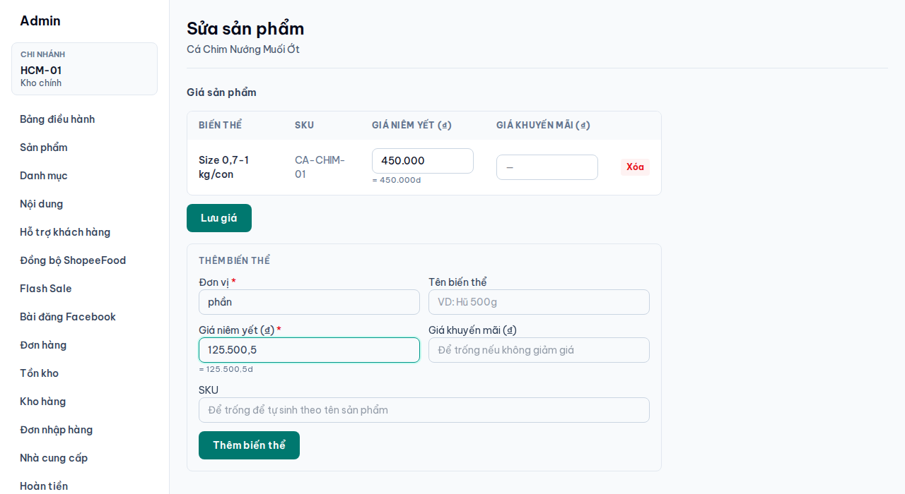

| Bạn gõ | Được lưu thành |
|---|---|
| `125000` hoặc `125.000` | 125.000đ |
| `1.250.000` | 1.250.000đ |
| `125500,5` hoặc `125500.5` | 125.500,5đ |
| `125.500,75` | 125.500,75đ |

> **Lưu ý:**
> - Dấu chấm theo sau đúng 3 chữ số (`125.000`) được hiểu là **dấu phân cách hàng nghìn**, không phải
>   phần lẻ.
> - Giá giữ tối đa **2 chữ số** sau dấu phẩy. Số lẻ hơn sẽ được làm tròn.
> - Nếu dòng xem trước báo **Giá không hợp lệ** (màu đỏ), hãy sửa lại trước khi lưu.
> - Ô **Giá khuyến mãi** để trống nếu sản phẩm không giảm giá.

Bấm **Lưu giá** (hoặc **Thêm biến thể** nếu đang thêm biến thể mới).

---

## 2. Ảnh QR tài khoản ngân hàng và logo app đặt hàng

Vào **Nội dung**, kéo xuống bảng **Hình ảnh: tài khoản ngân hàng, app đặt hàng, logo**. Bấm **Sửa**
ở mục đã có, hoặc **+ New** để thêm mục mới.

Form bây giờ có nút **Tải ảnh lên**: bấm vào, chọn ảnh trong máy (JPG, PNG, WEBP hoặc GIF, tối đa
5MB). Ảnh được tải lên và hiện xem trước ngay bên dưới. Bạn không cần tự đi tìm đường link ảnh nữa.

### 2.1 Thêm tài khoản ngân hàng (ảnh QR chuyển khoản)

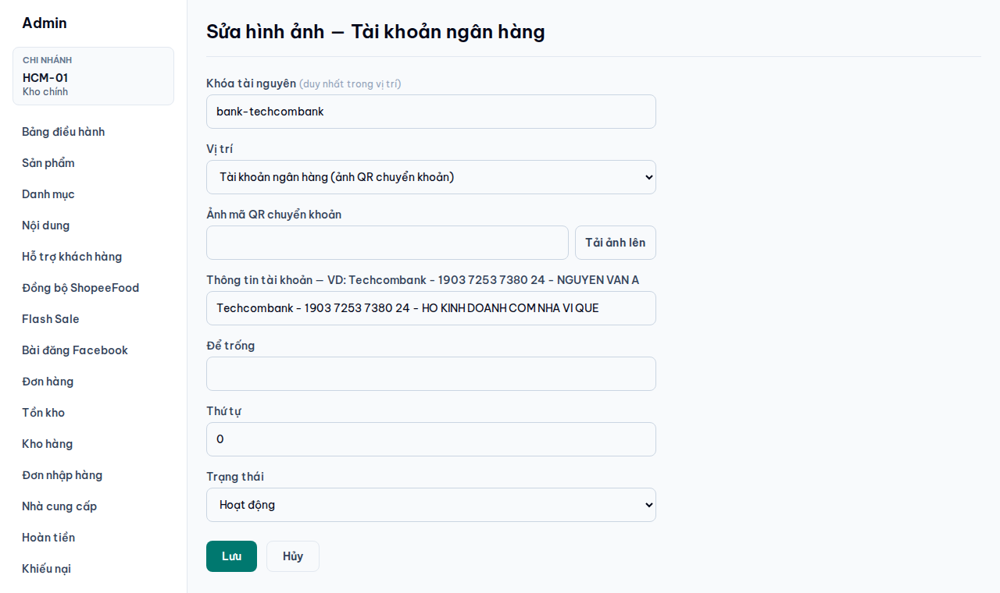

| Ô | Cách điền |
|---|---|
| **Khóa tài nguyên** | Tên ngắn không dấu, ví dụ `bank-techcombank` |
| **Vị trí** | Chọn **Tài khoản ngân hàng (ảnh QR chuyển khoản)** |
| **Ảnh mã QR chuyển khoản** | Bấm **Tải ảnh lên**, chọn ảnh QR lấy từ app ngân hàng |
| **Thông tin tài khoản** | Gõ trên **một dòng**, các phần cách nhau bằng dấu ` - ` (khoảng trắng, gạch ngang, khoảng trắng). Ví dụ: `Techcombank - 1903 7253 7380 24 - HO KINH DOANH COM NHA VI QUE` |
| **Để trống** | Không điền gì |
| **Thứ tự** | Số nhỏ hiện trước (khi có nhiều tài khoản) |
| **Trạng thái** | **Hoạt động** |

Bấm **Lưu**. Thông tin tài khoản sẽ hiện ở 3 nơi:

- **Trang thanh toán:** khi khách chọn *Chuyển khoản ngân hàng*.

  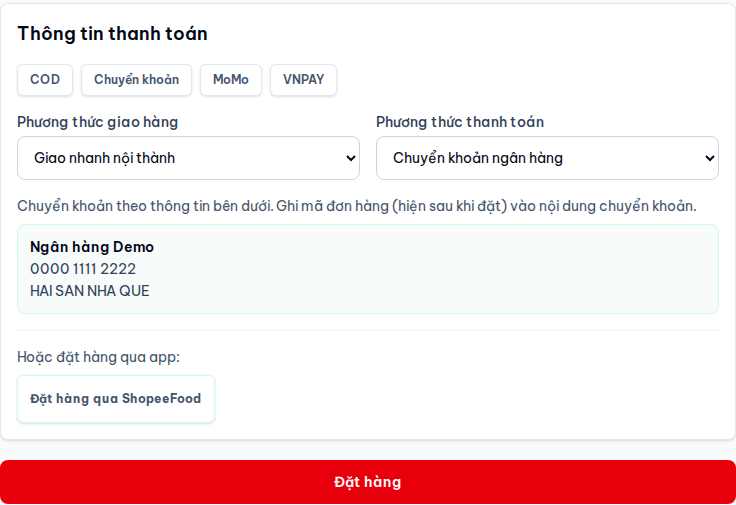

- **Trang Đặt hàng thành công:** có thêm dòng **Nội dung chuyển khoản: \<mã đơn hàng\>** để khách
  ghi vào khi chuyển khoản. Nhờ vậy bạn dễ đối chiếu tiền về với đơn nào.

  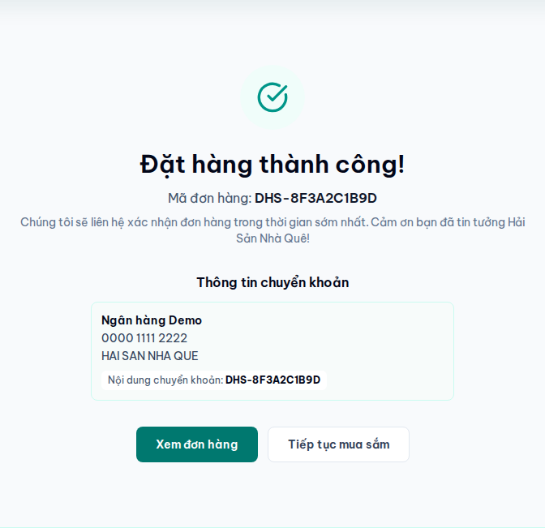

- **Chân trang** của mọi trang, mục *Chuyển khoản ngân hàng*.

### 2.2 Thêm app đặt hàng (ShopeeFood, GrabFood…)

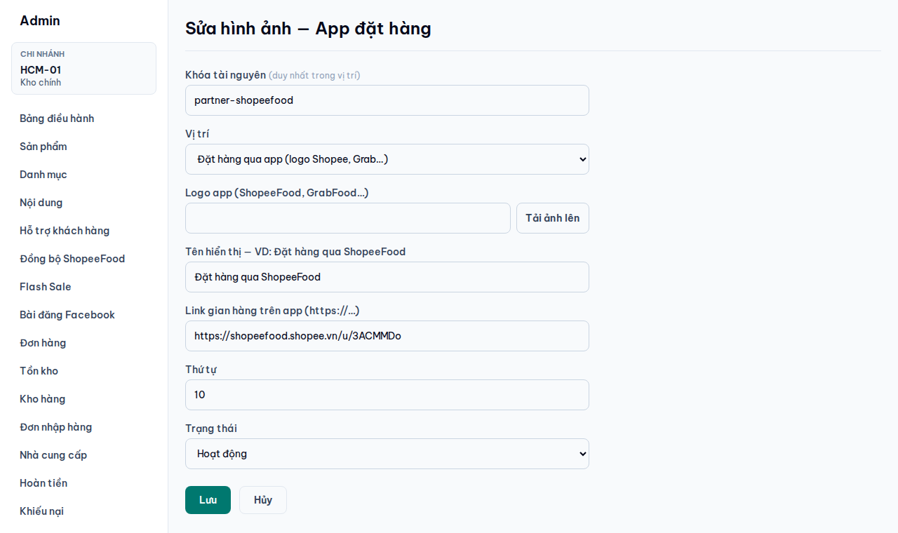

| Ô | Cách điền |
|---|---|
| **Khóa tài nguyên** | Ví dụ `order-app-shopeefood` |
| **Vị trí** | Chọn **Đặt hàng qua app (logo Shopee, Grab…)** |
| **Logo app** | Bấm **Tải ảnh lên**, chọn logo. Nên dùng ảnh nền trắng hoặc nền trong suốt, ngang khoảng 240px |
| **Tên hiển thị** | Ví dụ `Đặt hàng qua ShopeeFood` |
| **Link gian hàng trên app** | Dán link gian hàng của quán, bắt đầu bằng `https://` |
| **Trạng thái** | **Hoạt động** |

Logo hiện ở chân trang (mục *Đặt hàng qua app*) và cuối khung thanh toán. Khách bấm vào logo sẽ mở
gian hàng trong tab mới.

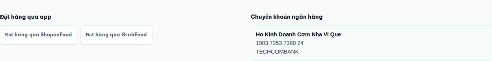

> **Việc cần làm ngay:** ShopeeFood, GrabFood và tài khoản Techcombank đã được chuyển sang đúng vị trí
> mới, nhưng vẫn đang dùng **ảnh mẫu**, nên trên web chỉ hiện chữ (như hình trên). Hãy bấm **Sửa**
> từng mục và **Tải ảnh lên** logo thật và ảnh QR thật.

> Muốn tạm ẩn một mục mà không xóa: đổi **Trạng thái** sang *Không hoạt động*.

---

## 3. Phông chữ đều nhau

Toàn bộ trang web (cả trang quản trị) giờ dùng chung một phông chữ: **Be Vietnam Pro**. Phông này
được thiết kế cho tiếng Việt, nên dấu không bị lệch phông và chữ đậm, chữ thường hiển thị đều nhau.
Bạn **không cần làm gì**.

---

## 4. Trang "Hỗ trợ khách hàng"

Các trang như *Chính sách giao hàng*, *Hướng dẫn đặt hàng*, *Đổi trả và khiếu nại* bây giờ do bạn
tự viết và tự sửa. Mỗi trang có địa chỉ riêng `haisannhaque.com/ho-tro/...` và **tự có link** trong
cột **Hỗ trợ khách hàng** ở chân trang.

Vào menu bên trái **Hỗ trợ khách hàng**. Danh sách hiện các trang đang có; bấm vào đường dẫn
`/ho-tro/...` để xem trang trên web.

### 4.1 Thêm hoặc sửa một trang

Bấm **Thêm trang** (hoặc **Sửa** ở trang đã có). Bên trái là ô nhập, bên phải là khung **Xem trước**
cho thấy trang sẽ hiện thế nào.

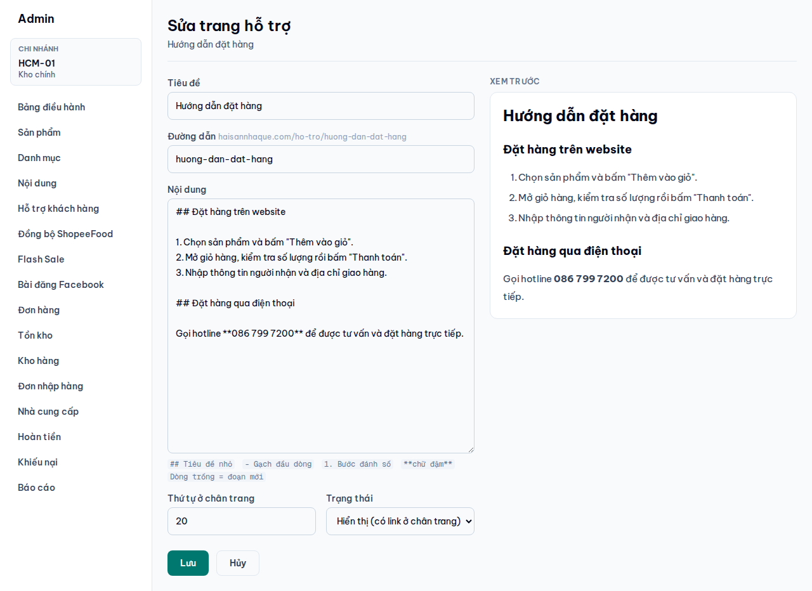

| Ô | Cách điền |
|---|---|
| **Tiêu đề** | Tên trang, cũng là chữ hiện ở chân trang |
| **Đường dẫn** | Tự tạo từ tiêu đề (bỏ dấu), thường không cần sửa |
| **Nội dung** | Nội dung trang (xem cách định dạng bên dưới) |
| **Thứ tự ở chân trang** | Số nhỏ đứng trước |
| **Trạng thái** | **Hiển thị**: khách xem được và có link ở chân trang. **Ẩn (bản nháp)**: chưa cho khách xem |

Bấm **Tạo trang** hoặc **Lưu**. Trang và link ở chân trang được cập nhật ngay.

### 4.2 Cách định dạng nội dung

Gõ chữ bình thường. Muốn có tiêu đề, gạch đầu dòng hay chữ đậm thì dùng các ký hiệu sau:

| Bạn gõ | Trên web hiện thành |
|---|---|
| `## Tiêu đề nhỏ` | Một tiêu đề mục |
| `- nội dung` | Gạch đầu dòng |
| `1. nội dung` | Danh sách đánh số (các bước) |
| `**chữ đậm**` | **chữ đậm** |
| Để **một dòng trống** | Bắt đầu đoạn văn mới |
| Dán một link `https://...` | Link bấm được |

Trang sau khi lưu sẽ hiện trên web như sau:

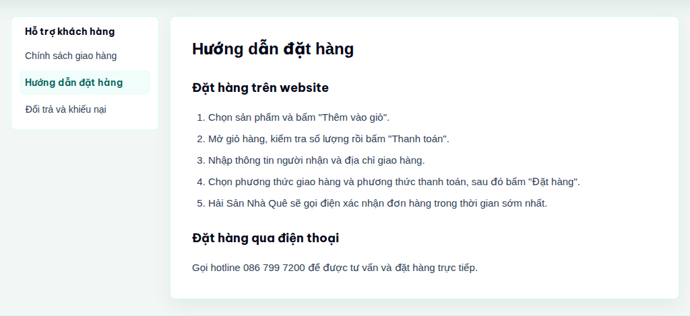

> **Việc cần làm:** trang *Chính sách giao hàng* và *Đổi trả và khiếu nại* hiện chỉ có nội dung tạm
> ("Nội dung chi tiết đang được cập nhật" và số hotline). Hãy viết nội dung chính sách thật cho hai
> trang này.

> **Đừng** sửa các link nhóm *Hỗ trợ khách hàng* trong bảng *Liên kết footer* ở trang Nội dung. Các
> link này tự đồng bộ theo trang; muốn đổi thì sửa trang tương ứng.

---

## 5. Khách đăng ký tài khoản để tích điểm

Khách tự đăng ký tại `haisannhaque.com/register`. Có link **Đăng ký** ở trang đăng nhập, trang thanh
toán và các trang tài khoản. Khách nhập họ tên, số điện thoại, email, mật khẩu (ít nhất 8 ký tự) là
dùng được ngay, không cần xác nhận email.

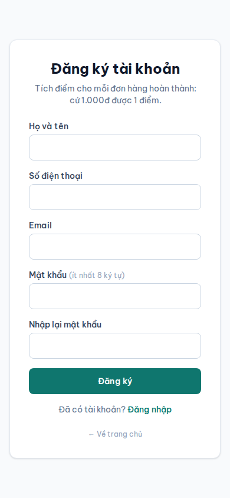

**Cách tích điểm hoạt động:**

- Khách **đăng nhập rồi đặt hàng** thì đơn được gắn vào tài khoản. Họ tên và số điện thoại được điền
  sẵn ở trang thanh toán.
- Khi bạn chuyển đơn sang trạng thái **Hoàn thành**, khách được cộng điểm: **cứ 1.000đ = 1 điểm**
  (theo tổng tiền đơn).
- Khách xem điểm và lịch sử điểm ở **Tài khoản → Tích điểm**.
- Đơn đặt khi **chưa đăng nhập** thì **không** được tích điểm, và không gắn lại vào tài khoản được.
  Trang thanh toán có dòng nhắc khách đăng nhập hoặc đăng ký trước khi đặt.

> **Quan trọng:** sau khi giao hàng xong, hãy vào **Đơn hàng** và chuyển đơn sang **Hoàn thành**. Nếu
> không, khách sẽ không được cộng điểm.

---

## 6. Mục "Bán chạy" ở trang chủ

Mục **Bán chạy** nằm giữa khung *Hải Sản Nhà Quê* và khung *Chợ hải sản hôm nay*. Sản phẩm xếp thành
một hàng ngang: trên máy tính có nút ‹ › để chuyển, trên điện thoại thì vuốt ngang.

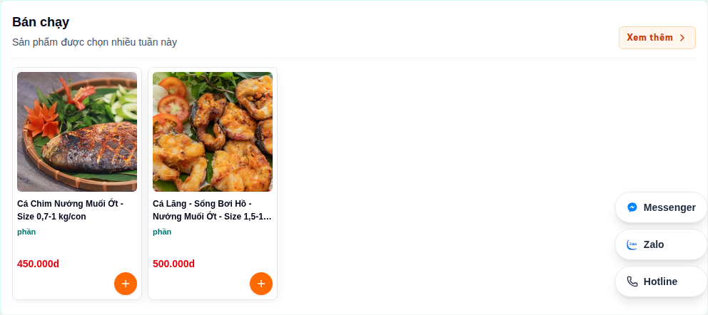

### 6.1 Chọn sản phẩm cho mục Bán chạy

1. Vào **Nội dung**, tìm bảng **Phần CMS**.
2. Ở hàng `best-sellers`, bấm nút **Sản phẩm**.
3. Gõ tên sản phẩm vào ô **Tìm sản phẩm để thêm…** rồi bấm chọn. Chỉ sản phẩm đang **published** mới
   tìm thấy được. Tối đa 40 sản phẩm.
4. Dùng nút **↑ / ↓** để sắp xếp (sản phẩm số 1 hiện đầu tiên), nút **✕** để bỏ sản phẩm.
5. Bấm **Lưu sản phẩm**. Trang chủ cập nhật ngay.

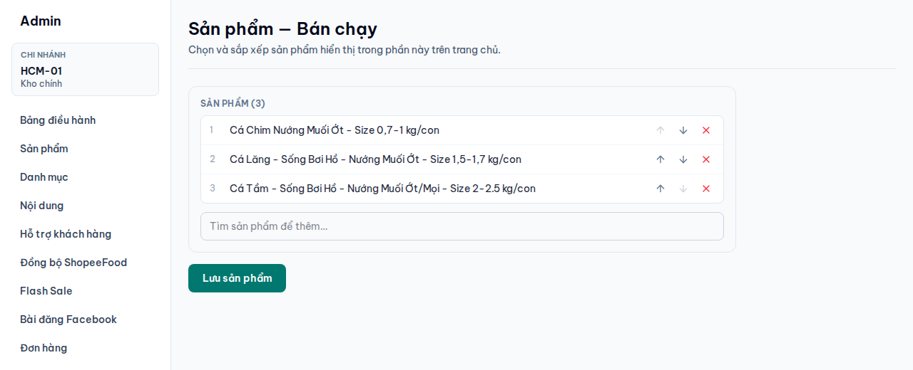

> **Vì sao chọn 5 sản phẩm mà trang chủ chỉ hiện 2?** Sản phẩm chỉ hiện khi có **ít nhất một biến thể
> đang bật** (có giá). Hiện tại *Cá Chép Giòn*, *Cá Mú Hấp Hồng Kông* và *Cá Tầm* đều đang tắt biến
> thể, nên bị ẩn. Vào **Sản phẩm → Sửa** từng món để bật lại biến thể, hoặc chọn sản phẩm khác.

### 6.2 Tuỳ chỉnh thêm

Bấm **Sửa** ở hàng `best-sellers` trong bảng **Phần CMS**:

| Muốn | Sửa ô |
|---|---|
| Đổi tên hoặc dòng mô tả | **Tiêu đề**, **Phụ đề** |
| Hiện dạng lưới thay vì hàng ngang | **Bố cục**: đổi `carousel` thành `default` |
| Đổi vị trí trên trang chủ | **Thứ tự**: số nhỏ đứng trước. Hiện là `5`, nằm giữa *Hải Sản Nhà Quê* (`0`) và *Chợ hải sản hôm nay* (`10`) |
| Tạm ẩn mục | **Trạng thái**: *Inactive* |

Các phần sản phẩm khác trên trang chủ cũng có nút **Sản phẩm** và chọn sản phẩm theo cách tương tự.

---

## Cần hỗ trợ thêm?

Tài liệu đầy đủ cho mọi màn hình quản trị: [Hướng Dẫn Vận Hành Admin](admin-operations-guide.md).
